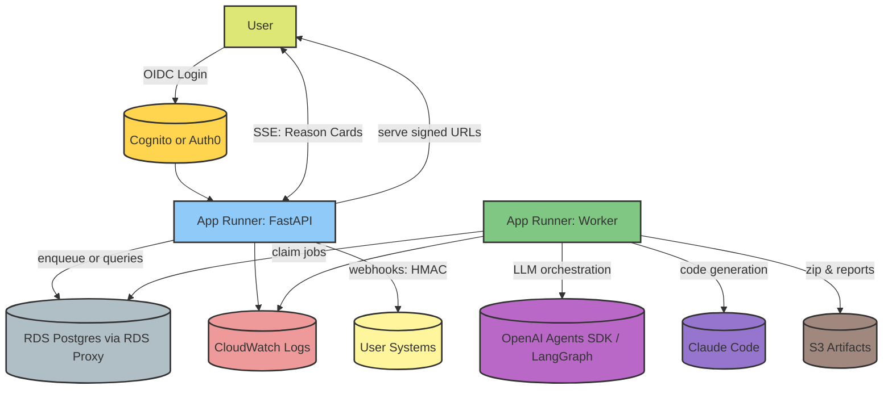

# Agentic MLOps Platform – MVP Architecture, Deployment Options & Roadmap

**Version:** 0.9 (MVP-ready)  
**Author:** <your name / team>  
**Date:** 2025‑08‑15

---

## 1) Executive Summary
A collaborative, multi‑agent system that **designs, critiques, and generates** production‑quality MLOps systems. The MVP delivers a **comprehensive architecture report** plus a **code artifact bundle (repo zip)** covering services, IaC, CI, and validation reports—without deploying any cloud resources. The design emphasizes trust: policy checks, cost/latency critics, deterministic diffs, and typed state with an event log.

The mission is to create a sophisticated, collaborative Agentic AI system that automates the end-to-end lifecycle of designing, implementing, and documenting production-quality Machine Learning Operations (MLOps) systems. This project moves beyond simple code generation. It aims to act as an expert MLOps architect and engineer, collaborating with human users to navigate complex trade-offs and build robust, scalable, and maintainable ML systems. The core vision is to drastically reduce the time and expertise required to deploy production-grade ML, transforming a months-long process into a matter of days, while ensuring best practices are followed at every step.


**Key decisions for MVP**
- Dual‑provider LLM stack: **Orchestration** (LangGraph) + **Code generation** (Anthropic Claude Code), behind a common provider interface.
- Deployment (recommended): **AWS App Runner (web) + App Runner (worker) + RDS Postgres + S3** with a DB‑backed job queue. 
- State: Postgres with **versioned decision sets**, **event log**, and **artifact hashes**.
- Trust features in MVP: **policy engine**, **two critics (tech & cost)**, **diff‑first UX (git‑backed)**, and **static validation** of generated repos.

---

## 2) Problem & Value Proposition
Teams waste weeks translating high‑level requirements into consistent, audited MLOps infrastructure. Our product turns **natural‑language constraints** into **reviewable designs & code** with explainability (critics), repeatability (events & diffs), and safety (policy checks), while preserving human control (HITL gates).

**Primary outcomes:**
- Hours → days from requirements to vetted repo.
- Traceable decision history; easy iteration on constraints.
- Vendor‑agnostic capability composition (not just pre‑canned pipelines).

---

## 3) Target Users & Representative Use Cases
- **Founding ML teams / Series A–B startups:** First production ML stack (RAG + batch training).
- **Platform teams in mid‑size enterprises:** Standardize patterns across clouds; generate compliant infra repos.
- **Consultancies / SIs:** Accelerate discovery → proposal → code artifacts.

---

## 4) Scope: MVP vs. Non‑Goals
**In‑scope (MVP)**
- Constraint intake → proposed architecture → policy/critic check → HITL approval → **repo generation (zip)**.
- Diffs across iterations; typed state and event log.
- Static validation (linters, schema checks, IaC validate) without cloud deploy.

**Out‑of‑scope (MVP)**
- Applying IaC, spinning cloud resources, running training/inference.
- Complex RBAC/e‑sign and full compliance automation (planned).
- Durable queue/broker beyond DB‑backed jobs (upgrade path defined).

---

## 5) Core Features (MVP)
1) **Constraint & Context Intake**  
   - Natural‑language input; extraction to a typed constraint schema: budget, regions, data‑class, latency/SLO, throughput, tooling prefs.

2) **Planning & Composition**  
   - Agents compose **capability patterns** (ingest, transform, store, feature, train, serve, observe, govern) per cloud.
   - Patterns are opinionated but composable; planner chooses under constraints.
   - Once all the required inputs are extracted, we trigger a series of Agents in pre-determined fixed order, this corresponds to LLM workflow Pattern rather than letting the Supervisor Agent determining which sub-agents or tools to execute. This determinstic approach provides us with full control and will significantly simplify the overall implementation since we are not relying on the Supervisor Agent determining which sub-agents should be triggerred. This will de-risk the entire application in a major way in terms of evaluation, managing state etc.

Following is the list of Dedicated/Specialized Agents for Planning and Implementing Production Grade End-to-end MLOPs System
1. Project Stages: An Iterative Path to Production. This agent will work on the following,
    1. Ideation & Planning
    2. Model experimentation, Iteration and Prototyping
    3. Pipelines Development
    4. Deployment & Serving
    5. Monitoring & Continual Learning
2. Versioning and Governance Strategy
    1. Code
    2. Infrastructure
    3. Data
    4. Prompts
    5. Models
3. Data Sourcing, Discovery, and Characteristics
    1. Data Sourcing & Discovery Plan
    2. Data Characteristics
    3. Exploratory Data Analysis
4. Pipelines/Workflows to be developed: An Operational Blueprint
    1. Data Ingestion Pipeline
        1. Batch, Streaming
        2. Is streaming pipeline needed
        3. Frequency of ingestion for batch and streaming pipelines
    2. Feature Engineering Pipeline
    3. Model Training Pipeline
    4. Inference Pipeline
    4. Monitoring & Observability Setup
    6. Continual Learning & Data Flywheel Pipeline
5. MLOps Tech Stack: An Architectural Blueprint
6. Comprehensive ML Testing Strategy
    1. Data & Features
    2. Code & Pipelines
    3. ML Models
    4. Infrastructure & Serving
    5. Online Testing / Testing in Production 
7. Planning Data Engineering and Data Ingestion Pipeline
    1. The Data Engineering Lifecycle
    2. Real-Time Streaming Pipeline: Design & Architecture
8. Planning Feature Engineering Pipelines
    1. Feature Engineering Lifecycle and Strategy
    2. List of features
    3. Batch Feature Pipeline
    4. Real-Time Streaming Feature Pipeline
9. Model Development & Iteration
10. Planning Model Training Pipelines
11. Planning Deployment, Serving
12. Planning Inference Pipeline
13. Monitoring and Observability Plan
14. Continual Learning & Production Testing
15. Governance, Ethics & The Human Element
16. Overall System Architecture
    1. Unified Architectural Blueprint
    2. Potential Bottlenecks, Cost and Performance Optimizations
    3. Estimated Monthly Costs
    4. Scaling Strategies
17. Code Implementation: Data Ingestion Pipeline
18. Code Implementation: Feature Engineering Pipeline
19. Code Implementation: Model Training Pipeline
20. Code Implementation: Inference Pipeline
21. Code Implementation: Monitoring & Observability, Testing in Production Setup
22. Code Implementation: Continual Learning & Data Flywheel Pipeline Setup
23. Critic Agent: Will provide a critical review of actions/decisions made by other agents (architectural decisions, choices, evaluates trade-offs, feasibility, risks). These agents can be triggerred 
    1. at the end of Planning Stage, the Manager Agent can then invoke the appropriate agent prompting it to re-think and update its decision/choice based on the feedback from Critic Agent. 
    2. at the end of Implementation Stage, to provide a comprehensive feedback on the entire end-to-end MLOPs System.


**Context Engineering**
   1. **System Prompt/Instructions**: Each agent will have dedicated set of instructions. Loaded from markdown file, this will contain all the details required for the agent to make the appropriate architectural choices. It will involve different factors to take into account, choices available, trade-offs, how to make the optimal choice, examples of common patterns/architectural choices etc
   2. **Reading and Writing State Information From Shared Persistent Memory**: This will be shared amongst all agents.  This will include the extracted user constraints in specified schema, each agent's architectural decisions in fixed schema, critic agent's feedback, user's updated set of requirements/constraints, new sets of decisions from other agents etc. Basically this memory is shared amongst all the agents so that each agent has context of the overall project ensuring that agents do not take sub-optimal decisions working in isolation. This memory will have the entire history of user constraints, agents decisions, critic's feedback etc. We have to ensure that the Agent Loop does not run infinitely, if it runs too long, we may have to have provision for summarising the context to avoid the context getting beyond the context window of the LLMs.


3) **Critics & Policy Engine**  
   - **Technical critic:** checks feasibility, coupling, bottlenecks, failure domains.  
   - **Cost critic:** order‑of‑magnitude monthly estimate from patterns/IaC.  
   - **Policy engine:** latency/budget/region/PII rules → pass/fail report.

4) **Diff‑First UX**  
   - Git‑backed diffs for architecture docs, repo manifests, and cost deltas (USD + %).  
   - Summary of changes persists alongside every decision set.

5) **Repo Generation (Zip)**  
   - Python services (FastAPI skeletons), IaC (Terraform), GitHub Actions, sample tests.  
   - `/reports` folder: policy report, IaC validate output, lint/test summaries, SBOM.

6) **Typed State & Event Log**  
   - Postgres models for projects, decision sets, artifacts, agent runs, approvals, cost estimates, and events.

7) **Frontend UI**
   - 3 columns/panels following the same design patterns of all the major AI/LLM Chat Interface tools such as ChatGPT, Google AI Studio, Anthropic Claude
      - Left side panel (narrow): Shows list of past chats, settings etc
      - Centre panel: Chat with Agent, human input Gates, Agent's Rationale/Reasoning Decisions are shown here
      - Right panel (Canvas): To show generated artifacts (code repo, report), diff 
   - Modern, minimal, sleek, elegant supporting both light and dark modes.
---

## 6) System Architecture (MVP)



**Notes**
- Single worker process suffices for MVP; can scale horizontally later.  
- All long‑running tasks run in the worker; API remains responsive.  
- DB is the job queue (lightweight): `jobs` table with retries and backoff.
- SSE heartbeats enabled; signed URLs time‑boxed; all DB/S3 access scoped by `project_id`; jobs use SKIP LOCKED + leases.
---

## 7) Data Model (Initial)
- `projects(id, name, owner_id, created_at, ...)`
- `decision_sets(id, project_id, parent_id, version, status, constraints_jsonb, plan_jsonb, summary_md, created_at, updated_at)`
- `artifacts(id, decision_set_id, path, sha256, kind, size_bytes, created_at)`
- `agent_runs(id, decision_set_id, agent, provider, model, input_jsonb, output_jsonb, tokens_total, latency_ms, ok, created_at)`
- `approvals(id, decision_set_id, gate, actor, status, comment, created_at)`
- `cost_estimates(id, decision_set_id, monthly_usd, breakdown_jsonb, method, created_at)`
- `events(id, decision_set_id, type, payload_jsonb, created_at)`
- `jobs(id, type, payload_jsonb, status, retries, next_run_at, created_at, updated_at)`

**Rules**
- Optimistic locking on `decision_sets`.  
- Every material change emits an `events` row.  
- All artifacts stored in S3 with SHA‑256 in DB for integrity and diffing.

---

## 8) Deployment (MVP‑friendly)


### **AWS App Runner**
- **What:** App Runner service for **FastAPI (web)** and a second App Runner service for the **worker**; **RDS Postgres**; **S3** for artifacts.  
- **Pros:** Fully managed build/deploy, HTTPS, autoscaling without cluster mgmt; single‑cloud story; simplest AWS path  
- **Cons:** Limited background job primitives (we roll our own via DB); fewer knobs than ECS.  
- **Fit:** Best MVP trade‑off: low ops, unified cloud, straightforward scale to SQS later.

It’s one cloud, low‑ops, supports the **single worker** pattern today, and upgrades cleanly:
- Add **SQS** later without changing the API/worker services.  
- Migrate worker to **ECS/Fargate** if you need CPU‑heavy workloads.

---

## 9) Tech Stack (MVP)
**Frontend**
- NextJS 14+, TypeScript, Tailwind CSS, Shadcn UI

**Backend & Orchestration**  
- FastAPI, Pydantic, SQLAlchemy.  
- Orchestration: OpenAI Agents SDK **or** LangGraph.  
- Code‑gen provider: Anthropic Claude Code (plus optional OpenAI Code model) behind a `CodeGenProvider` interface.

**Data & Storage**  
- Postgres (AWS RDS), S3 for artifacts/zips, optional Redis (ElastiCache) later for caching.

**Build & CI for Generated Repos**  
- GitHub Actions, `ruff`, `mypy`, `pytest`, `pip‑audit`, `cyclonedx`, `terraform validate`, `tflint`, `hadolint`, `actionlint`.

**Observability & Telemetry**  
- Structured JSON logs; request IDs; per‑LLM call metrics (tokens, latency, model).  
- OpenTelemetry exporters later; minimal dashboards first (CloudWatch Logs Insights).

**Security (MVP)**  
- Server‑side key management; no secrets in generated repos.  
- Redaction in logs; project‑scoped data isolation.

---

## 10) Implementation Strategy

### Step 1 — Foundations (Week 1–2)
- Project scaffolding: API, DB migrations, S3 client.  
- Data model tables and **event log**.  
- `jobs` table and **single worker** service with retry/backoff.

### Step 2 — Provider Abstraction & Schemas (Week 2–3)
- `CodeGenProvider` + `OrchestrationProvider` interfaces.  
- Pydantic schemas for **all agent I/O**; fail closed with validation.

### Step 3 — Capability Patterns & Planner (Week 3–4)
- Define capability taxonomy; implement 2–3 patterns per capability per cloud (AWS first).  
- Planner composes patterns under constraints.

### Step 4 — Critics & Policies (Week 4–5)
- Implement **technical critic** and **cost critic**.  
- Policy engine with pass/fail report; persist in `/reports`.

### Step 5 — Repo Generation & Static Validation (Week 5–6)
- Codegen for services + IaC + CI.  
- Run validators; create zip with `/reports` + diffs; store in S3.

### Step 6 — Diff‑First UX & Review Flow (Week 6–7)
- Server‑side git for artifacts; show unified diffs (docs + repo tree + cost).  
- HITL approvals recorded in DB.

### Step 7 — Pilot & Hardening (Week 7–8)
- Golden scenarios; prompt library; regression harness.  
- Observability, basic rate limiting, and backpressure controls.

---

## 11) APIs (Illustrative)
- `POST /projects` – create project.  
- `POST /projects/{id}/constraints` – add/modify constraints → enqueues job.  
- `GET /projects/{id}/decision-sets` – list with versions/diffs.  
- `GET /decision-sets/{id}` – plan, critics, policy, artifacts.  
- `POST /decision-sets/{id}/approve` – record HITL approval.  
- `POST /decision-sets/{id}/generate` – force regeneration (admin).

---

## 12) Testing & Evaluation
- **Golden prompts**: canonical inputs with expected plan structure.  
- **Determinism**: temperature controls, seed, tool‑call contracts.  
- **Static checks**: IaC validate, linters, type checks, SBOM, SCA; all in `/reports`.  
- **Acceptance metrics**: proposal acceptance rate, diff size, time‑to‑artifact, LLM error rates.

---

## 13) Security & Privacy (MVP Baseline)
- Keys stored server‑side; scoped per project.  
- PII redaction in logs; configurable data retention.  
- No outbound credentials in artifacts.

**Future:** per‑tenant KMS keys, Vault integration, workload identity, data‑class tagging and policy enforcement.

---

## 14) Roadmap – Planned for Future
- **Apply Mode:** dry‑run, cost/permission checks, staged apply to sandbox, smoke tests, rollback.  
- **RBAC & Approvals:** roles (Owner, Architect, Reviewer, FinOps) with e‑sign audit.  
- **Agent Telemetry & Replay:** per‑agent trace store, replay/fork, blacklist suggestions.  
- **Durable Orchestration:** move to SQS → ECS workers; optional Temporal/Step Functions.  
- **Evented Lineage:** link data/model/prompt/infra versions to decisions.  
- **Adapters:** multi‑cloud capability layer; provider feature flags.  
- **Compliance Copilot & FinOps Copilot.**  
- **Repo‑ingest “Fix‑my‑MLOps.”**  
- **Challenge Packs & Adversarial Critics.**

---

## 15) Non‑Functional Requirements
- **SLOs (MVP):** p95 plan roundtrip ≤ 5 min; artifact generation ≤ 10 min; availability 99.5%.  
- **Scalability:** horizontal App Runner/ECS scale; DB connection pooling; backpressure via job polling.  
- **Reliability:** idempotent job execution keyed by decision set; exponential backoff.

---

## 16) Risks & Mitigations
- **Provider instability** → dual‑provider interface, circuit breakers, cached few‑shots.  
- **Non‑deterministic outputs** → strict JSON schemas, validators, regression harness.  
- **User trust** → diffs, policy reports, static validation, design rationale in docs.  
- **Scope creep** → capability patterns constrain search; roadmap gates.

---

## 17) Decision: Deployment Choice (for this MVP)
**AWS App Runner + RDS + S3**. Rationale: single‑cloud buyer appeal, minimal ops, clean path to SQS/ECS later without redesign.

---

## 18) Appendices
- **A. Example Policy Rules** (latency, regions, budget, data‑class).  
- **B. Example Capability Patterns** per cloud.  
- **C. Example Diff Report Format** (doc diff, repo manifest diff, cost delta).  
- **D. Example `/reports` bundle layout.**


---

## 19) Transparent Reasoning & Agent Rationale (User‑Facing)
**Goal:** Build trust by exposing *what ran*, *why a choice was made*, and *what alternatives were rejected*—without leaking raw model chain‑of‑thought or secrets.

**What we show (summarized as “Reason Cards” per decision):**
- **Agent & Step:** name, version, run ID, timestamps.
- **Trigger & Inputs:** constraints referenced, artifacts consulted, prior decisions.
- **Options Considered:** short list of candidates with pros/cons.
- **Decision & Rationale:** concise justification mapped to explicit constraints/policies.
- **Policy & Cost Impact:** pass/fail checks, estimated monthly delta, latency/availability implications.
- **Confidence & Risks:** score with top uncertainties and suggested probes.
- **Links:** diff to previous version, cost report, related events.

**How it’s produced:**
- Each agent returns a **structured rationale** object (pydantic) – *not* free‑form hidden CoT.
- The worker converts it into a **Decision Ledger** entry and emits an `event` (e.g., `plan_proposed`, `critic_passed`).
- Rationale is embedded in the generated **Design Rationale** section and exported into `/reports/rationale.json` in the repo zip.

**Spec (illustrative):**
```json
{
  "decision_id": "uuid",
  "agent": "planner|critic.tech|critic.cost|codegen",
  "trigger": "constraints_updated|user_approve|regen",
  "inputs": {"constraints_keys": ["budget","regions","sla"], "artifacts": ["capability:ingest:s3-batch"]},
  "candidates": [{"id":"optA","summary":"…","tradeoffs":["…"]}],
  "choice": {"id":"optA","justification":"…"},
  "policy_results": {"budget":"pass","region":"pass","pii":"warn"},
  "impacts": {"monthly_usd": 420, "p95_latency_ms": 180},
  "confidence": 0.74,
  "risks": ["quota risk on bedrock:us-east-1"],
  "links": {"diff":"/diffs/ds_12_vs_13.md","cost":"/reports/cost.json"}
}
```

**UI patterns:**
- **Timeline** of agent runs with expandable Reason Cards (lazy‑loaded to keep the UI responsive). 
- **“What just happened?”** side panel after each recompute.
- **Export**: rationale bundle inside the repo’s `/reports` and embedded in docs.

**Privacy & Safety:** redact secrets/PII; never expose raw prompts or provider transcripts; internal “debug mode” gated behind admin.

---

## 20) Input Strategy – Guided vs. Freeform (Adaptive Intake)
**Recommendation:** Hybrid, **adaptive** approach that starts freeform and escalates to targeted questions only when coverage is insufficient or conflicts are detected.

**Flow:**
1. **Freeform First:** user writes requirements → extractor maps to a typed **Constraint Schema**.
2. **Coverage Check:** compute a **Constraint Coverage Score** (e.g., required fields: cloud/region, budget band, workload types, SLOs, data‑class).
3. **Adaptive Questioner:** if coverage < threshold or constraints conflict, ask the **minimum** set of high‑value questions (batch vs streaming, serverless vs containers, budget band, compliance flags, preferred stack, existing assets).
4. **Guided Mode:** offer a 2–5 minute wizard up front for users who prefer structure; responses persist as the **Intake Snapshot**.
5. **Proceed to Planning:** planner composes capability patterns; any remaining gaps are tracked as open questions and surfaced in Reason Cards.

**Constraint Schema (starter fields):** `cloud`, `regions`, `budget_band`, `data_classification`, `sla_latency_ms`, `availability_target`, `throughput`, `workload_types[batch,streaming,online]`, `deployment_pref[serverless,containers]`, `storage_prefs`, `observability_prefs`, `team_constraints (languages, skills)`, `existing_stack`, `compliance (GDPR/HIPAA etc.)`.

**UX:** two entry points — **Quick Start (freeform)** and **Guided Setup**. Show live **coverage meter** and highlight missing/ambiguous items; never block progress unless a policy requires it (e.g., region or data‑class).

**Metrics:** question count per session, acceptance rate of first plan, rework rate, time‑to‑artifact, unresolved‑constraints after planning.

---


---

## 21) Implementation Details (LangGraph)
**Goal:** Make the MVP’s multi‑agent flow deterministic, observable, and resumable on AWS App Runner while using LangGraph’s primitives.

### 21.1 Graph Topology (fixed, deterministic)
Nodes (in order):
1. **intake_extract** → parse freeform input into **Constraint Schema**.
2. **coverage_check** → compute coverage score; emit missing/ambiguous fields.
3. **adaptive_questions** → (optional) minimal follow‑ups; loop until threshold.
4. **planner** → compose capability patterns into a candidate plan.
5. **critic_tech** → feasibility, coupling, bottlenecks; emit risks.
6. **critic_cost** → coarse BOM + monthly estimate; compute deltas vs previous.
7. **policy_eval** → apply rules; pass/warn/fail with explanations.
8. **gate_hitl** *(interrupt)* → require user approval; capture inline comments.
9. **codegen** → generate repo skeletons (services, IaC, CI, docs).
10. **validators** → run static checks; compile `/reports`.
11. **rationale_compile** → transform per‑node rationale → **Reason Cards** + **Design Rationale** doc section.
12. **diff_and_persist** → commit artifacts to git/S3; write `decision_set` + `events`; output composite Change Summary.

> Each node yields structured **stream events** for the UI (see §22.3).

### 21.2 Shared State & Checkpointing
- **State keys:** `constraints`, `coverage`, `plan`, `candidates`, `policy`, `cost`, `hitl`, `artifacts`, `reports`, `diff_summary`, `run_meta`.
- **Checkpointer:** LangGraph PostgresSaver. `thread_id` = `decision_set_id` (UUID). Each node **merges** into state; we store a pointer to the latest checkpoint in `decision_sets` for time‑travel.

### 21.3 Idempotency & Side‑effects
- **Idempotency key:** `sha256(thread_id | node_name | canonical_json(input))`.
- Before executing a node, look up `agent_runs(idem_key)`; if `ok=true`, **reuse** output.
- **Artifacts:** write to S3 under `projects/{pid}/ds_{ver}/{sha256}-{filename}`; duplicates are harmless; DB stores hashes.
- **Optimistic locking:** update `decision_sets` with `version` and `updated_at`; on conflict, reload and retry with backoff.

### 21.4 Provider Abstractions & Resilience
- Interfaces: `OrchestrationProvider` (LangGraph-native tools) and `CodeGenProvider` (Anthropic Claude Code). 
- **Schema‑first:** every tool/LLM output validated via Pydantic; failures produce a user‑friendly Reason Card.
- **Circuit breakers:** cooldown per provider/model on 429/5xx; fall back for *non‑codegen* nodes.
- **Determinism:** fixed temperature/top‑p; **few‑shot pack registry** loaded by content hash ID.

### 21.5 Policy Engine & Cost Critic (MVP)
- **Rules:** JSONLogic/Python rules over `constraints` + `plan` (e.g., `budget_band`, `regions`, `data_classification`, `sla_latency_ms`).
- **Cost:** extract BOM from patterns/IaC (instances, storage GB, requests/s); estimate monthly USD → `cost_estimates`.
- **Surfacing:** policy + cost deltas streamed before HITL; stored in `/reports/policy.json` and `/reports/cost.json`.

### 21.6 Streaming & UX on App Runner
- SSE endpoint streams `reason-card`, `policy-update`, `cost-update`, `diff-update`, `gate-waiting`, `run-error`, `run-complete`.
- Heartbeats every 10s; disconnect handling marks `stream_abandoned=true/false`.
- Events include `project_id`, `decision_set_id`, `run_id`, `node_name`, `ts` for multi‑tenant correlation.

### 21.7 Diff‑First Persistence
- **Server‑side git repo per project**; commit plan/docs/repo manifests each version.
- **DeepDiff** on state objects + **unified text diffs** on markdown/code; compose into a single Change Summary.

### 21.8 HITL Ergonomics
- Inline comments on plan; persisted to `approvals` and fed back into `planner` on resume.
- Approvals can **expire**; reminders via email/webhook; stale runs marked accordingly.

### 21.9 Testing & Eval
- **Golden runs** with frozen inputs; assert on schemas, policy pass, presence of mandatory capabilities.
- **Determinism budget:** on N consecutive schema failures, capture payloads to a quarantine bucket.

### 21.10 Security & Hygiene (MVP)
- Redact secrets/PII in logs and Reason Cards; no secrets in generated repos.
- Per‑environment LangSmith projects with retention; request/trace IDs carried end‑to‑end.

### 21.11 AWS App Runner Notes
- Two services: **api** (FastAPI) and **worker**; worker has higher CPU/mem. 
- **RDS Proxy** for Postgres pooling; S3 same region; SSE‑S3 enabled. 
- Structured logs to CloudWatch: `{request_id, run_id, thread_id, node_name, model, tokens, latency_ms}`.

---

## 22) API & Contracts Appendix

### 22.1 REST Endpoints (MVP)
- `POST /projects` → create project.
- `POST /projects/{id}/constraints` → add/modify constraints; returns `{decision_set_id, stream_url}`.
- `GET /streams/{decision_set_id}` → SSE stream (see §22.3).
- `GET /decision-sets/{id}` → details (plan, critics, policy, artifacts, diffs).
- `GET /decision-sets/{id}/events` → event log timeline.
- `POST /decision-sets/{id}/approve` → HITL approval `{status, comment}`.

**Idempotency:** Clients may send `Idempotency-Key` header on mutating routes; server dedupes on this key.

### 22.2 Core Schemas (abridged)
**Reason Card**
```json
{
  "decision_id": "uuid",
  "agent": "planner|critic.tech|critic.cost|codegen",
  "node_name": "critic_cost",
  "trigger": "constraints_updated|user_approve|regen",
  "inputs": {"constraints_keys": ["budget_band","regions"], "artifacts": ["capability:ingest:s3-batch"]},
  "candidates": [{"id":"optA","summary":"…","tradeoffs":["…"]}],
  "choice": {"id":"optA","justification":"…"},
  "policy_results": {"budget":"pass","region":"pass","pii":"warn"},
  "impacts": {"monthly_usd": 420, "p95_latency_ms": 180},
  "confidence": 0.74,
  "risks": ["quota risk in us-east-1"],
  "links": {"diff":"/diffs/ds_12_vs_13.md","cost":"/reports/cost.json"},
  "ts": "2025-08-17T10:15:22Z"
}
```

**Policy Results**
```json
{
  "rules": [
    {"id":"latency_slo","status":"pass","detail":"p95<=200ms"},
    {"id":"budget_band","status":"warn","detail":"est $420 > target $400"},
    {"id":"region_policy","status":"pass","detail":"all resources in eu-west-1"}
  ],
  "overall": "warn"
}
```

**Cost Estimate**
```json
{
  "monthly_usd": 420.0,
  "breakdown": [
    {"service":"s3","qty":"500GB","usd": 12.5},
    {"service":"ec2-fargate","qty":"vCPU-hrs","usd": 350.0}
  ],
  "method": "bom_v1",
  "delta_vs_prev_usd": 55.0,
  "delta_vs_prev_pct": 15.1
}
```

**Diff Summary**
```json
{
  "docs_changed": ["plan.md"],
  "files_added": 7,
  "files_removed": 1,
  "files_modified": 12,
  "cost_delta_usd": 55.0,
  "state_keys_changed": ["plan","policy","cost"],
  "git_commit": "a1b2c3d"
}
```

### 22.3 SSE Event Types
Events are `event:` lines with JSON payloads on `data:` lines.
- `reason-card` → Reason Card payload
- `policy-update` → Policy Results
- `cost-update` → Cost Estimate
- `diff-update` → Diff Summary
- `gate-waiting` → `{decision_set_id, gate:"pre-codegen", ts}`
- `run-error` → `{decision_set_id, node_name, message, ts}`
- `run-complete` → `{decision_set_id, version, ts}` (always emitted last)
- Heartbeats → `event: ping` with empty `{}` every 10s

### 22.4 Error Model
```json
{
  "error": {
    "code": "validation_failed|rate_limited|provider_down|conflict|not_found",
    "message": "human readable",
    "retry_after_s": 30,
    "run_id": "uuid",
    "node_name": "critic_cost"
  }
}
```

### 22.5 Webhooks (optional)
- `plan.ready`, `gate.waiting`, `run.complete`, `run.error` – signed with HMAC; retry with backoff.

---


---

## 23) Operational Hardening (MVP+)
This section folds in final guardrails so the MVP feels production‑minded without increasing scope.
These features are not to be included in initial MVP, can be added once the initial MVP is ready.

### 23.1 AuthN/AuthZ & Multi‑Tenancy
- **Identity:** OIDC (Amazon Cognito or Auth0). API validates JWT on every request & SSE connection.
- **Authorization:** Project‑scoped access checks on all routes; include `project_id` in every DB query and SSE payload.
- **Data partitioning:** S3 prefixes `projects/{project_id}/…`; DB tables carry `project_id` (indexed). Optional RLS later.
- **Webhooks:** Signed with HMAC; replay protection via `idempotency_key` + expiry.
- **Audit:** Correlate `request_id`, `run_id`, `thread_id`, and `user_id` in logs & events.

### 23.2 Job Claiming & Exactly‑Once Semantics
- **Claim pattern:** Single SQL round‑trip with `FOR UPDATE SKIP LOCKED` + lease.
- **Lease fields:** `lease_expires_at`, `worker_id`, `retries`.
- **Renewal:** Workers renew lease periodically; on crash, expired jobs are re‑claimable.
- **Idempotency:** Per‑node `idem_key = sha256(thread_id|node|canonical_json(input))` gates side effects; artifacts written with content‑hash keys.

**Example (illustrative SQL):**
```sql
UPDATE jobs SET status='running', worker_id=:wid,
  lease_expires_at=NOW() + INTERVAL '5 minutes'
WHERE id = (
  SELECT id FROM jobs
  WHERE status='queued' AND next_run_at <= NOW()
  ORDER BY priority DESC, created_at ASC
  FOR UPDATE SKIP LOCKED
  LIMIT 1
)
RETURNING *;
```

### 23.3 Schema Evolution & Migrations
- **Migrations:** Alembic from day one; version stamps on `events` and `decision_sets`.
- **State upgrades:** On‑read transform hook when Pydantic models change.
- **Backfills:** Lightweight scripts to re‑compute derived fields (e.g., cost deltas) for old rows.

### 23.4 Prompt & Few‑Shot Governance
- **Pack registry:** Few‑shot packs checked into a server‑side git repo; each referenced by **content hash**.
- **Traceability:** Every Reason Card/event includes `prompt_pack_hash`; diffs show "Prompt pack vX→vY" when it changes.
- **Controls:** Fixed temperature/top‑p; provider circuit breakers/cooldowns per model.

### 23.5 Budgets, Rate Limits & Cost Gating
- **Per‑project budgets:** token & concurrency quotas; soft warn at 80%, hard stop at 100%.
- **Cost critic thresholds:** Require HITL if `Δcost_usd > Y` or `Δcost_pct > X%` vs previous decision set.
- **Pre‑run estimator:** Planner predicts token usage; pause if projected spend exceeds remaining budget.

### 23.6 Streaming Resilience & Artifact Hygiene
- **SSE:** Heartbeats every 10s; max stream duration; `run-complete` (terminal) + `decision_set_summary` events.
- **Resume path:** UI can reconstruct via `GET /decision-sets/{id}/events` + latest checkpoint.
- **Artifacts:** Time‑boxed **signed S3 URLs**; lifecycle rules (e.g., expire zips after 14 days).
- **Secret scans:** Validators fail build if secrets/personal tokens detected in artifacts.

### 23.7 Testing & Release Gates
- **Golden runs:** Deterministic inputs with assertions on schemas, policy overall != `fail`, and presence of mandatory capabilities.
- **Property‑based tests:** Fuzz constraint inputs to test extractor/coverage and planner robustness.
- **Quarantine bucket:** Persist failing LLM payloads under safeguards for triage.
- **Release gate:** Ship only if golden & property tests pass and validation reports are green.

### 23.8 Observability & SLOs
- **Dashboards:** time‑to‑artifact, SSE disconnect rate, job retries, LLM error codes, cost deltas.
- **Alerts:** sustained 5xx on API, job retry storms, policy `fail` spikes, budget threshold crossings.


___

# **Comprehensive Implementation Plan: The Resilient Agentic MLOps Platform (v2)**

This plan details how to build your platform's features using LangGraph, incorporating the advanced resilience, security, and ergonomic patterns outlined in your updated roadmap.

#### **1. System Architecture & Operational Foundation (per Roadmap §8, §23.11)**

We will adopt the recommended **Option B: AWS App Runner** for its balance of managed simplicity and a clear path to scalability.

*   **Core Components:**
    *   **API Service (App Runner):** FastAPI service for all synchronous user interactions (intake, approvals, fetching diffs/events).
    *   **Worker Service (App Runner):** A separate, more resource-intensive service for running the LangGraph workflows.
    *   **Database (AWS RDS Postgres with RDS Proxy):** The source of truth for projects, decision sets, events, jobs, and checkpoints. The proxy handles efficient connection pooling.
    *   **Artifact Store (AWS S3):** For storing zipped code bundles, reports, and committed plan documents. It will be in the same AWS region as the services, with SSE-S3 encryption enabled by default.

*   **Observability:**
    *   **Tracing:** LangSmith will be enabled via environment variables (`LANGCHAIN_TRACING_V2`, `LANGCHAIN_API_KEY`).
    *   **Logging:** All services will emit structured JSON logs to Amazon CloudWatch. Crucially, every log entry will include `request_id`, `run_id`, `thread_id`, and `node_name` to allow direct correlation between application logs and LangSmith traces.

#### **2. State, Persistence, and Idempotency (per Roadmap §7, §21.2, §21.3, §23.2)**

This is the bedrock of the system's resilience and auditability. We will implement a multi-layered persistence strategy.

1.  **LangGraph State & Checkpointing:**
    *   **State Schema:** A central `MLOpsProjectState` TypedDict will define the shared memory for the main workflow, including `constraints`, `plan`, `policy_results`, `cost_estimate`, etc.
    *   **Checkpointer:** We will use `langgraph.checkpoint.postgres.PostgresSaver`, configured to connect to our RDS instance. The `thread_id` for a given workflow run will correspond to its `decision_set_id`.

2.  **Explicit Audit Event Log:**
    *   **Rationale:** While checkpoints store the *state*, the `events` table provides a lightweight, human-readable log of *what happened*. It's optimized for UI timelines and auditing.
    *   **Implementation:** A utility function, `log_event(state, event_type, payload)`, will be called at the end of each significant node. It will write a new row to the `events` table, including the `decision_set_id` and the `checkpoint_id` of the state *after* the event, creating a direct link for time-travel. The FastAPI backend will expose a `/decision-sets/{id}/events` endpoint to serve this timeline.

3.  **Idempotency & Exactly-Once Semantics (Critical for Resilience):**
    *   **Node-Level Idempotency:** The worker will use the `agent_runs` table. Before executing a node, it will compute an idempotency key: `sha256(thread_id | node_name | canonical_json_hash(input_state))`. If a successful run with this key exists in `agent_runs`, the worker will skip execution and return the cached output.
    *   **Side-Effect Guards:** All writes to S3 will use a content-based hash as the object key (e.g., `s3://.../artifacts/{sha256-of-content}.zip`). This makes uploads naturally idempotent.
    *   **Optimistic Locking:** The `decision_sets` table will have a `version` integer column. All `UPDATE` statements will include `WHERE id = ? AND version = ?`. If the update affects 0 rows, it signifies a race condition. The worker will catch this, reload the latest state, and retry the operation with exponential backoff.

#### **3. The Adaptive Intake Workflow (per Roadmap §20, §21.1)**

This initial phase is a self-contained graph that ensures all prerequisites are met before the main planning starts.

*   **State Schema:** A dedicated `IntakeState` will manage the process, holding the `raw_query`, the Pydantic `ConstraintSchema` object, `missing_fields`, and `intake_messages`.
*   **Graph Nodes & Flow:**
    1.  **`extract_constraints`:** An LLM-powered node that uses tool-calling to populate the `ConstraintSchema` Pydantic model from the user's text.
    2.  **`coverage_check`:** A deterministic Python node that calculates a "Constraint Coverage Score" and identifies mandatory missing fields.
    3.  **`adaptive_questioner`:** An LLM-powered node that generates a question for the user *only if* the coverage check fails.
    4.  **`gate_user_input` (Interrupt):** The graph pauses using `interrupt_after` to wait for the user's response.
*   **Control Flow:** A conditional edge after `coverage_check` either proceeds to the main planning workflow or loops back through the `adaptive_questioner` and `gate_user_input`.

#### **4. Deterministic Agent Orchestration (per Roadmap §21.1)**

As specified, the core workflow is a fixed, sequential graph, providing predictability and simplifying debugging.

*   **LangGraph Implementation:** We will use **normal edges** (`builder.add_edge(...)`) to define the precise order of execution for the planning and generation agents. The graph topology will follow the sequence defined in section `21.1` of your roadmap, from `planner` to `critic_tech`, `critic_cost`, `policy_eval`, the `gate_hitl` interrupt, and finally to `codegen` and `validators`.

#### **5. Provider Resilience & Determinism (per Roadmap §16, §21.4)**

*   **Provider Abstraction:** All LLM calls will be routed through `OrchestrationProvider` and `CodeGenProvider` interfaces.
*   **Resilience:** We will implement circuit breakers (using a library like `pybreaker`) within these providers to handle transient 429/5xx errors. For non-codegen steps, we will configure `.with_fallbacks()` to a secondary model/provider.
*   **Determinism:** All LLM calls will use a fixed `temperature=0`. Few-shot examples will be managed in a "pack registry" (a version-controlled file or simple DB table) and referenced by a content hash ID in the `ReasonCard` to ensure reproducibility.
*   **Schema-First Validation:** Every LLM output that expects a structure (e.g., a plan, a tool call) will be immediately validated against its Pydantic model. A validation failure will trigger an internal retry loop where the error is fed back to the LLM, asking it to correct its output.

#### **6. Streaming, "Reason Cards", and SSE Resilience (per Roadmap §19, §21.6, §22.3)**

This is the core of the user-facing transparency.

*   **LangGraph Implementation:**
    *   Each node in the graph will be a function that accepts the `StreamWriter` from the runtime config.
    *   After performing its logic, the node will construct a `ReasonCard` Pydantic object and immediately stream it using `writer.write([("reason-card", card.model_dump())])`. Other event types (`policy-update`, `cost-update`) will be streamed similarly from their respective nodes.
*   **SSE Resilience on App Runner:**
    *   The FastAPI SSE endpoint will send a `event: ping` heartbeat every 10 seconds to prevent idle connection timeouts.
    *   The worker's `writer.write()` calls will be wrapped in a `try...except` block. A disconnection will be caught, and a `stream_abandoned=True` flag will be set in the database for the corresponding run.
    *   A final `event: run-complete` message will always be sent, allowing the UI to reliably terminate the stream.

#### **7. Human-in-the-Loop (HITL) Ergonomics (per Roadmap §21.8)**

*   **LangGraph Implementation:**
    *   We will use `langgraph.interrupt.interrupt_after` to create the `gate_hitl` node.
    *   When the user approves via the API, they can include an optional `comment` field.
    *   When resuming the graph, this comment is passed in the input. A dedicated node immediately after the interrupt (`process_approval_feedback`) will parse this comment and update the `constraints` in the state before the `codegen` agent runs.

#### **8. Diff-First UX (Git + State) (per Roadmap §5, §21.7)**

*   **LangGraph Implementation:**
    *   The `diff_and_persist` node at the end of the workflow will be responsible for this.
    *   It will use a library like `pygit2` to programmatically manage a server-side Git repository for each project. It will commit the human-readable plan documents and repo manifest.
    *   The FastAPI `/decision-sets/{id}` endpoint will fetch the current and parent `decision_set` checkpoints from Postgres to compute a state diff using `deepdiff`. It will also use `pygit2` to compute a `git diff` between the two associated commits, returning a single, composite "Change Summary" JSON object to the UI.

#### **9. Code Generation and Validation (per Roadmap §5, §21.1)**

*   **LangGraph Implementation:** The `codegen` node will orchestrate the Anthropic Code SDK as a tool. The `validators` node will then execute a series of checks on the generated code *in a sandboxed environment* before zipping. This includes running `ruff`, `terraform validate`, and a secret scanner. The results will be compiled into the `/reports` directory.

#### **10. Testing & Evaluation Harness (per Roadmap §12, §21.9)**

*   **Implementation:** We will create a `pytest` suite for "golden runs." These tests will invoke the full graph with deterministic inputs and assert on the final state and generated reports. Key assertions will include:
    *   The final Pydantic `plan` object is valid.
    *   The `policy_eval` result is `pass`.
    *   Specific, mandatory "capability patterns" are present in the plan.
*   The "determinism budget" will be implemented: if a node's schema validation retry loop fails 3 times, it will raise a special exception, and a global error handler in the worker will save the invalid payload to a designated S3 quarantine bucket for triage.
---

## Development Guidelines

### Build

 - Install Python dependencies with `uv sync --extra dev`.
- Install frontend dependencies with `npm install`.
- Build the frontend with `npm run build`.
- Run the API locally with `uv run fastapi dev api/main.py`.
- Run the worker locally with `uv run python worker/main.py`.

### Testing

- `pre-commit run --all-files`
- `pytest`
- `npm test`

### Commit

- Use conventional commit messages (e.g., `feat: add api route`).
- Ensure all tests pass and the working tree is clean before committing.

