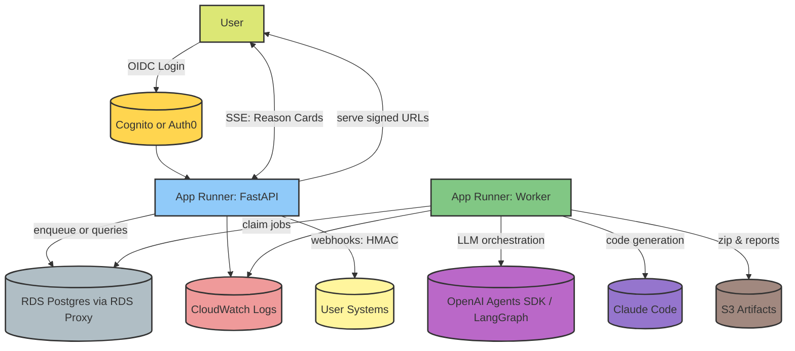

# Agentic MLOps Platform – MVP Architecture, Deployment Options & Roadmap

**Version:** 0.9 (MVP-ready)  
**Author:** <your name / team>  
**Date:** 2025‑08‑15

---

## 1) Executive Summary
A collaborative, multi‑agent system that **designs, critiques, and generates** production‑quality MLOps systems. The MVP delivers a **comprehensive architecture report** plus a **code artifact bundle (repo zip)** covering services, IaC, CI, and validation reports—without deploying any cloud resources. The design emphasizes trust: policy checks, cost/latency critics, deterministic diffs, and typed state with an event log.

The mission is to create a sophisticated, collaborative Agentic AI system that automates the end-to-end lifecycle of designing, implementing, and documenting production-quality Machine Learning Operations (MLOps) systems. This project moves beyond simple code generation. It aims to act as an expert MLOps architect and engineer, collaborating with human users to navigate complex trade-offs and build robust, scalable, and maintainable ML systems. The core vision is to drastically reduce the time and expertise required to deploy production-grade ML, transforming a months-long process into a matter of days, while ensuring best practices are followed at every step.

**Key decisions for MVP**
- Dual‑provider LLM stack: **Orchestration** (LangGraph) + **Code generation** (Anthropic Claude Code), behind a common provider interface.
- Deployment (recommended): **AWS App Runner (web) + App Runner (worker) + RDS Postgres + S3** with a DB‑backed job queue. 
- State: Postgres with **versioned decision sets**, **event log**, and **artifact hashes**.
- Trust features in MVP: **policy engine**, **two critics (tech & cost)**, **diff‑first UX (git‑backed)**, and **static validation** of generated repos.

---

## 2) Problem & Value Proposition
Teams waste weeks translating high‑level requirements into consistent, audited MLOps infrastructure. Our product turns **natural‑language constraints** into **reviewable designs & code** with explainability (critics), repeatability (events & diffs), and safety (policy checks), while preserving human control (HITL gates).

**Primary outcomes:**
- Hours → days from requirements to vetted repo.
- Traceable decision history; easy iteration on constraints.
- Vendor‑agnostic capability composition (not just pre‑canned pipelines).

---

## 3) Target Users & Representative Use Cases
- **Founding ML teams / Series A–B startups:** First production ML stack (RAG + batch training).
- **Platform teams in mid‑size enterprises:** Standardize patterns across clouds; generate compliant infra repos.
- **Consultancies / SIs:** Accelerate discovery → proposal → code artifacts.

---

## 4) Scope: MVP vs. Non‑Goals
**In‑scope (MVP)**
- Constraint intake → proposed architecture → policy/critic check → HITL approval → **repo generation (zip)**.
- Diffs across iterations; typed state and event log.
- Static validation (linters, schema checks, IaC validate) without cloud deploy.

**Out‑of‑scope (MVP)**
- Applying IaC, spinning cloud resources, running training/inference.
- Complex RBAC/e‑sign and full compliance automation (planned).
- Durable queue/broker beyond DB‑backed jobs (upgrade path defined).

---

## 5) Core Features (MVP)
1) **Constraint & Context Intake**  
   - Natural‑language input; extraction to a typed constraint schema: budget, regions, data‑class, latency/SLO, throughput, tooling prefs.

2) **Planning & Composition**  
   - Agents compose **capability patterns** (ingest, transform, store, feature, train, serve, observe, govern) per cloud.
   - Patterns are opinionated but composable; planner chooses under constraints.
   - Once all the required inputs are extracted, we trigger a series of Agents in pre-determined fixed order, this corresponds to LLM workflow Pattern rather than letting the Supervisor Agent determining which sub-agents or tools to execute. This determinstic approach provides us with full control and will significantly simplify the overall implementation since we are not relying on the Supervisor Agent determining which sub-agents should be triggerred. This will de-risk the entire application in a major way in terms of evaluation, managing state etc.

Following is the list of Dedicated/Specialized Agents for Planning and Implementing Production Grade End-to-end MLOPs System
1. Project Stages: An Iterative Path to Production. This agent will work on the following,
    1. Ideation & Planning
    2. Model experimentation, Iteration and Prototyping
    3. Pipelines Development
    4. Deployment & Serving
    5. Monitoring & Continual Learning
2. Versioning and Governance Strategy
    1. Code
    2. Infrastructure
    3. Data
    4. Prompts
    5. Models
3. Data Sourcing, Discovery, and Characteristics
    1. Data Sourcing & Discovery Plan
    2. Data Characteristics
    3. Exploratory Data Analysis
4. Pipelines/Workflows to be developed: An Operational Blueprint
    1. Data Ingestion Pipeline
        1. Batch, Streaming
        2. Is streaming pipeline needed
        3. Frequency of ingestion for batch and streaming pipelines
    2. Feature Engineering Pipeline
    3. Model Training Pipeline
    4. Inference Pipeline
    4. Monitoring & Observability Setup
    6. Continual Learning & Data Flywheel Pipeline
5. MLOps Tech Stack: An Architectural Blueprint
6. Comprehensive ML Testing Strategy
    1. Data & Features
    2. Code & Pipelines
    3. ML Models
    4. Infrastructure & Serving
    5. Online Testing / Testing in Production 
7. Planning Data Engineering and Data Ingestion Pipeline
    1. The Data Engineering Lifecycle
    2. Real-Time Streaming Pipeline: Design & Architecture
8. Planning Feature Engineering Pipelines
    1. Feature Engineering Lifecycle and Strategy
    2. List of features
    3. Batch Feature Pipeline
    4. Real-Time Streaming Feature Pipeline
9. Model Development & Iteration
10. Planning Model Training Pipelines
11. Planning Deployment, Serving
12. Planning Inference Pipeline
13. Monitoring and Observability Plan
14. Continual Learning & Production Testing
15. Governance, Ethics & The Human Element
16. Overall System Architecture
    1. Unified Architectural Blueprint
    2. Potential Bottlenecks, Cost and Performance Optimizations
    3. Estimated Monthly Costs
    4. Scaling Strategies
17. Code Implementation: Data Ingestion Pipeline
18. Code Implementation: Feature Engineering Pipeline
19. Code Implementation: Model Training Pipeline
20. Code Implementation: Inference Pipeline
21. Code Implementation: Monitoring & Observability, Testing in Production Setup
22. Code Implementation: Continual Learning & Data Flywheel Pipeline Setup
23. Critic Agent: Will provide a critical review of actions/decisions made by other agents (architectural decisions, choices, evaluates trade-offs, feasibility, risks). These agents can be triggerred 
    1. at the end of Planning Stage, the Manager Agent can then invoke the appropriate agent prompting it to re-think and update its decision/choice based on the feedback from Critic Agent. 
    2. at the end of Implementation Stage, to provide a comprehensive feedback on the entire end-to-end MLOPs System.

**Context Engineering**
   1. **System Prompt/Instructions**: Each agent will have dedicated set of instructions. Loaded from markdown file, this will contain all the details required for the agent to make the appropriate architectural choices. It will involve different factors to take into account, choices available, trade-offs, how to make the optimal choice, examples of common patterns/architectural choices etc
   2. **Reading and Writing State Information From Shared Persistent Memory**: This will be shared amongst all agents.  This will include the extracted user constraints in specified schema, each agent's architectural decisions in fixed schema, critic agent's feedback, user's updated set of requirements/constraints, new sets of decisions from other agents etc. Basically this memory is shared amongst all the agents so that each agent has context of the overall project ensuring that agents do not take sub-optimal decisions working in isolation. This memory will have the entire history of user constraints, agents decisions, critic's feedback etc. We have to ensure that the Agent Loop does not run infinitely, if it runs too long, we may have to have provision for summarising the context to avoid the context getting beyond the context window of the LLMs.

3) **Critics & Policy Engine**  
   - **Technical critic:** checks feasibility, coupling, bottlenecks, failure domains.  
   - **Cost critic:** order‑of‑magnitude monthly estimate from patterns/IaC.  
   - **Policy engine:** latency/budget/region/PII rules → pass/fail report.

4) **Diff‑First UX**  
   - Git‑backed diffs for architecture docs, repo manifests, and cost deltas (USD + %).  
   - Summary of changes persists alongside every decision set.

5) **Repo Generation (Zip)**  
   - Python services (FastAPI skeletons), IaC (Terraform), GitHub Actions, sample tests.  
   - `/reports` folder: policy report, IaC validate output, lint/test summaries, SBOM.

6) **Typed State & Event Log**  
   - Postgres models for projects, decision sets, artifacts, agent runs, approvals, cost estimates, and events.

7) **Frontend UI**
   - 3 columns/panels following the same design patterns of all the major AI/LLM Chat Interface tools such as ChatGPT, Google AI Studio, Anthropic Claude
      - Left side panel (narrow): Shows list of past chats, settings etc
      - Centre panel: Chat with Agent, human input Gates, Agent's Rationale/Reasoning Decisions are shown here
      - Right panel (Canvas): To show generated artifacts (code repo, report), diff 
   - Modern, minimal, sleek, elegant supporting both light and dark modes.
---

## 6) System Architecture (MVP)

**Notes**
- Single worker process suffices for MVP; can scale horizontally later.  
- All long‑running tasks run in the worker; API remains responsive.  
- DB is the job queue (lightweight): `jobs` table with retries and backoff.
- SSE heartbeats enabled; signed URLs time‑boxed; all DB/S3 access scoped by `project_id`; jobs use SKIP LOCKED + leases.
---

## 7) Data Model (Initial)
- `projects(id, name, owner_id, created_at, ...)`
- `decision_sets(id, project_id, parent_id, version, status, constraints_jsonb, plan_jsonb, summary_md, created_at, updated_at)`
- `artifacts(id, decision_set_id, path, sha256, kind, size_bytes, created_at)`
- `agent_runs(id, decision_set_id, agent, provider, model, input_jsonb, output_jsonb, tokens_total, latency_ms, ok, created_at)`
- `approvals(id, decision_set_id, gate, actor, status, comment, created_at)`
- `cost_estimates(id, decision_set_id, monthly_usd, breakdown_jsonb, method, created_at)`
- `events(id, decision_set_id, type, payload_jsonb, created_at)`
- `jobs(id, type, payload_jsonb, status, retries, next_run_at, created_at, updated_at)`

**Rules**
- Optimistic locking on `decision_sets`.  
- Every material change emits an `events` row.  
- All artifacts stored in S3 with SHA‑256 in DB for integrity and diffing.

---

## 8) Deployment (MVP‑friendly)

### **AWS App Runner**
- **What:** App Runner service for **FastAPI (web)** and a second App Runner service for the **worker**; **RDS Postgres**; **S3** for artifacts.  
- **Pros:** Fully managed build/deploy, HTTPS, autoscaling without cluster mgmt; single‑cloud story; simplest AWS path  
- **Cons:** Limited background job primitives (we roll our own via DB); fewer knobs than ECS.  
- **Fit:** Best MVP trade‑off: low ops, unified cloud, straightforward scale to SQS later.

It’s one cloud, low‑ops, supports the **single worker** pattern today, and upgrades cleanly:
- Add **SQS** later without changing the API/worker services.  
- Migrate worker to **ECS/Fargate** if you need CPU‑heavy workloads.

---

## 9) Tech Stack (MVP)
**Frontend**
- NextJS 14+, TypeScript, Tailwind CSS, Shadcn UI

**Backend & Orchestration**  
- FastAPI, Pydantic, SQLAlchemy.  
- Orchestration: OpenAI Agents SDK **or** LangGraph.  
- Code‑gen provider: Anthropic Claude Code (plus optional OpenAI Code model) behind a `CodeGenProvider` interface.

**Data & Storage**  
- Postgres (AWS RDS), S3 for artifacts/zips, optional Redis (ElastiCache) later for caching.

**Build & CI for Generated Repos**  
- GitHub Actions, `ruff`, `mypy`, `pytest`, `pip‑audit`, `cyclonedx`, `terraform validate`, `tflint`, `hadolint`, `actionlint`.

**Observability & Telemetry**  
- Structured JSON logs; request IDs; per‑LLM call metrics (tokens, latency, model).  
- OpenTelemetry exporters later; minimal dashboards first (CloudWatch Logs Insights).

**Security (MVP)**  
- Server‑side key management; no secrets in generated repos.  
- Redaction in logs; project‑scoped data isolation.

---

## 11) APIs (Illustrative)
- `POST /projects` – create project.  
- `POST /projects/{id}/constraints` – add/modify constraints → enqueues job.  
- `GET /projects/{id}/decision-sets` – list with versions/diffs.  
- `GET /decision-sets/{id}` – plan, critics, policy, artifacts.  
- `POST /decision-sets/{id}/approve` – record HITL approval.  
- `POST /decision-sets/{id}/generate` – force regeneration (admin).

---

___

## Development Guidelines

### Build

 - Install Python dependencies with `uv sync --extra dev`.
- Install frontend dependencies with `npm install`.
- Build the frontend with `npm run build`.
- Run the API locally with `uv run fastapi dev api/main.py`.
- Run the worker locally with `uv run python worker/main.py`.

### Testing

- `pre-commit run --all-files`
- `pytest`
- `npm test`

### Commit

- Use conventional commit messages (e.g., `feat: add api route`).
- Ensure all tests pass and the working tree is clean before committing.

