# Agentic MLOps Platform: Technical Architecture Whitepaper

**Version**: 1.0
**Date**: January 2025
**Classification**: Technical Architecture

---

## Executive Summary

The Agentic MLOps Platform represents a paradigm shift in machine learning operations, leveraging autonomous multi-agent systems to design, validate, and generate production-ready MLOps architectures. This whitepaper details the comprehensive technical architecture that enables intelligent automation while maintaining human oversight and enterprise-grade reliability.

Built on a foundation of LangGraph orchestration, Claude Code generation, and real-time streaming transparency, the platform transforms months-long MLOps design processes into hours-long autonomous workflows with full audit trails and decision transparency.

---

## Table of Contents

1. [System Overview](#system-overview)
2. [Core Architecture](#core-architecture)
3. [Multi-Agent Framework](#multi-agent-framework)
4. [Real-Time Streaming Architecture](#real-time-streaming-architecture)
5. [Human-in-the-Loop System](#human-in-the-loop-system)
6. [Code Generation Pipeline](#code-generation-pipeline)
7. [Data Architecture & State Management](#data-architecture--state-management)
8. [Infrastructure & Deployment](#infrastructure--deployment)
9. [Security & Compliance](#security--compliance)
10. [Monitoring & Observability](#monitoring--observability)
11. [Performance & Scalability](#performance--scalability)
12. [Integration Architecture](#integration-architecture)
13. [Quality Assurance](#quality-assurance)

---

## System Overview

### High-Level Architecture

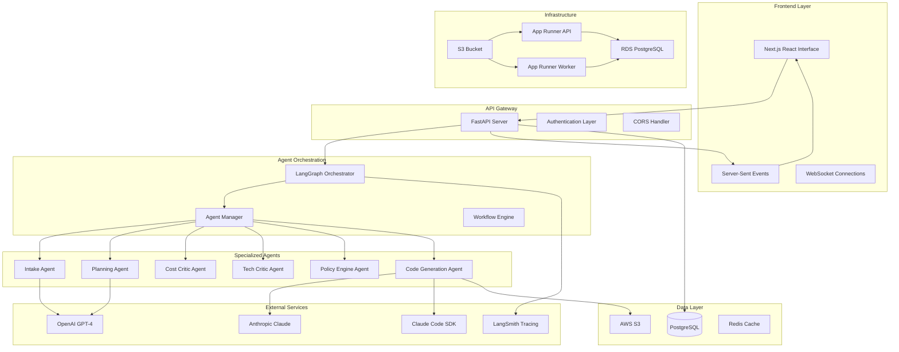

### Core Principles

**Autonomous Intelligence**: Multi-agent systems that operate independently while maintaining human oversight through strategic intervention points.

**Transparent Decision-Making**: Real-time streaming of agent reasoning, confidence scores, and decision rationales for full transparency.

**Production-Ready Outputs**: Generate complete, validated infrastructure-as-code repositories ready for enterprise deployment.

**Enterprise Scalability**: Cloud-native architecture supporting multi-tenant operations with high availability and horizontal scaling.

---

## Core Architecture

### Application Architecture

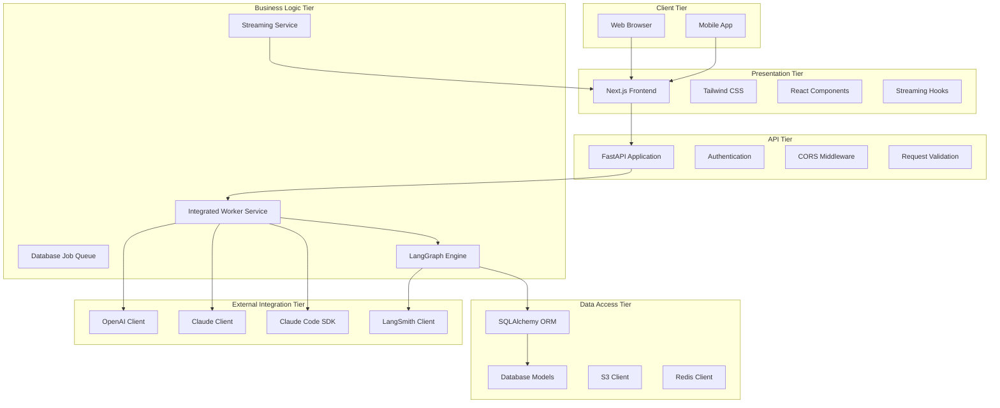

### Technology Stack

**Frontend Technologies**:
- Next.js 14 with App Router
- React 18 with Server Components
- TypeScript for type safety
- Tailwind CSS for styling
- Server-Sent Events for real-time updates

**Backend Technologies**:
- FastAPI for high-performance API
- Python 3.11+ with asyncio
- SQLAlchemy 2.0 for database ORM
- Pydantic for data validation
- uvicorn for ASGI server

**Agent Framework**:
- LangGraph for deterministic workflows
- LangChain for LLM integration
- OpenAI GPT-4 for reasoning
- Anthropic Claude for code generation
- Claude Code SDK for repository creation

**Infrastructure**:
- AWS App Runner for serverless deployment
- PostgreSQL on RDS for persistent data
- S3 for artifact storage
- CloudWatch for monitoring
- Terraform for infrastructure as code

---

## Multi-Agent Framework

### Agent Architecture

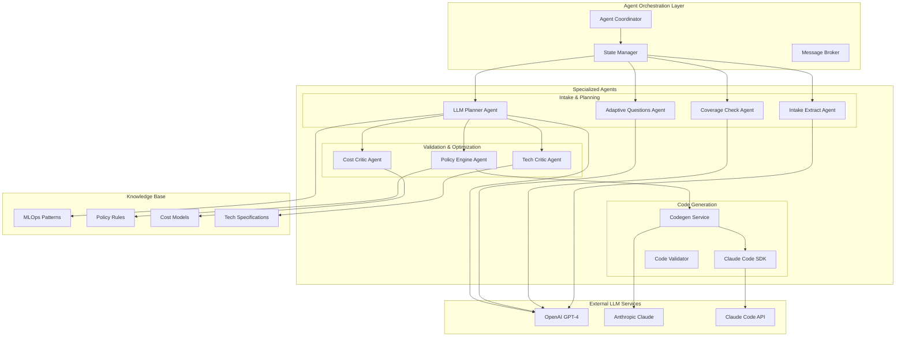

### Agent Specializations

**Intake Extract Agent**:
- Natural language processing for requirement extraction
- Constraint parsing and validation
- Context understanding and clarification
- Structured data transformation

**Coverage Check Agent**:
- Requirement completeness validation
- Gap identification and reporting
- Dependency analysis
- Constraint consistency checking

**Adaptive Questions Agent**:
- Dynamic question generation for missing information
- Smart default value suggestion
- Context-aware question prioritization
- User interaction optimization

**LLM Planner Agent**:
- Architecture pattern selection
- Component composition and integration
- Scalability and performance planning
- Technology stack optimization

**Tech Critic Agent**:
- Technical feasibility assessment
- Architecture pattern validation
- Performance bottleneck identification
- Security vulnerability scanning

**Cost Critic Agent**:
- Cost estimation and optimization
- Resource utilization analysis
- Budget constraint validation
- Cost-performance trade-off analysis

**Policy Engine Agent**:
- Compliance rule enforcement
- Security policy validation
- Governance requirement checking
- Regulatory adherence verification

### Agent Communication Protocol

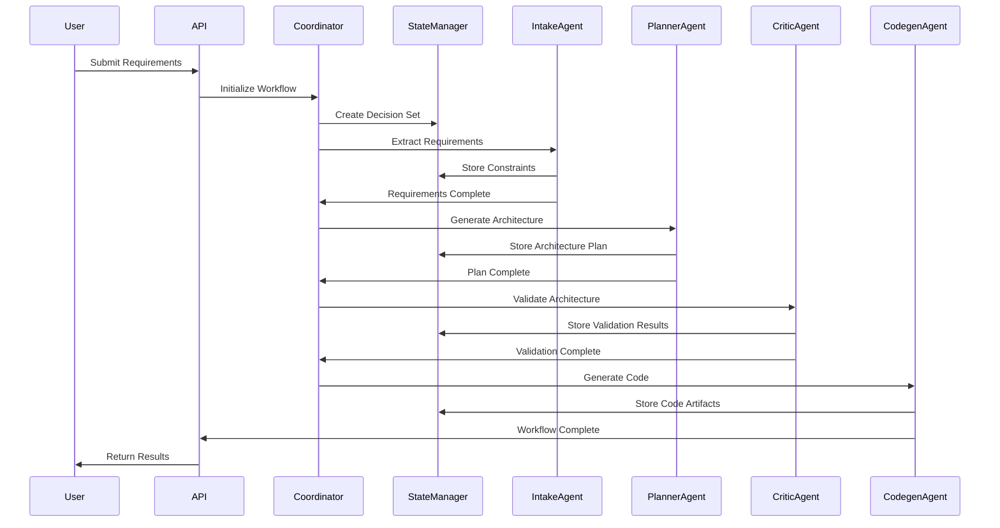

---

## Real-Time Streaming Architecture

### Streaming Event System

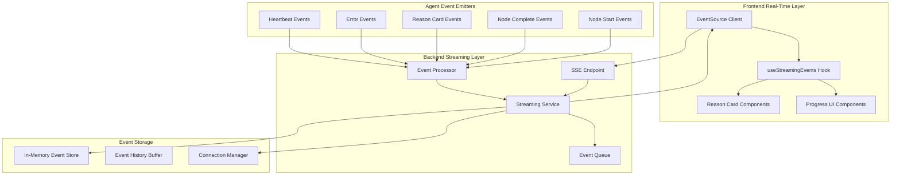

### Event Types and Structure

**Node Events**:
```typescript
interface NodeEvent {
  type: 'node-start' | 'node-complete';
  decision_set_id: string;
  timestamp: string;
  data: {
    node: string;
    message?: string;
    outputs?: Record<string, any>;
  };
}
```

**Reason Card Events**:
```typescript
interface ReasonCardEvent {
  type: 'reason-card';
  decision_set_id: string;
  timestamp: string;
  data: {
    agent: string;
    node: string;
    reasoning: string;
    decision: string;
    confidence: number;
    inputs: Record<string, any>;
    outputs: Record<string, any>;
    alternatives_considered: string[];
    category: string;
    priority: string;
  };
}
```

**Workflow Events**:
```typescript
interface WorkflowEvent {
  type: 'workflow-start' | 'workflow-complete' | 'workflow-paused';
  decision_set_id: string;
  timestamp: string;
  data: {
    status: string;
    progress_percentage: number;
    estimated_time_remaining?: number;
  };
}
```

### Streaming Service Implementation

**Connection Management**:
- In-memory connection registry per decision set
- Automatic connection cleanup on disconnect
- Heartbeat mechanism for connection health
- Exponential backoff for reconnection attempts

**Event Broadcasting**:
- Asynchronous event distribution to all connected clients
- Event deduplication and ordering guarantees
- Memory-efficient event buffering (1000 events max, cleanup to 500)
- Historical event replay for new connections

**Resilience Features**:
- Automatic reconnection with exponential backoff
- Connection health monitoring
- Graceful degradation on connection failures
- Client-side event buffering and replay

---

## Human-in-the-Loop System

### HITL Architecture

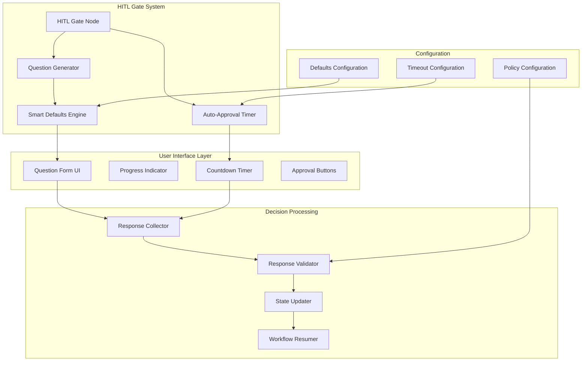

### HITL Event Flow

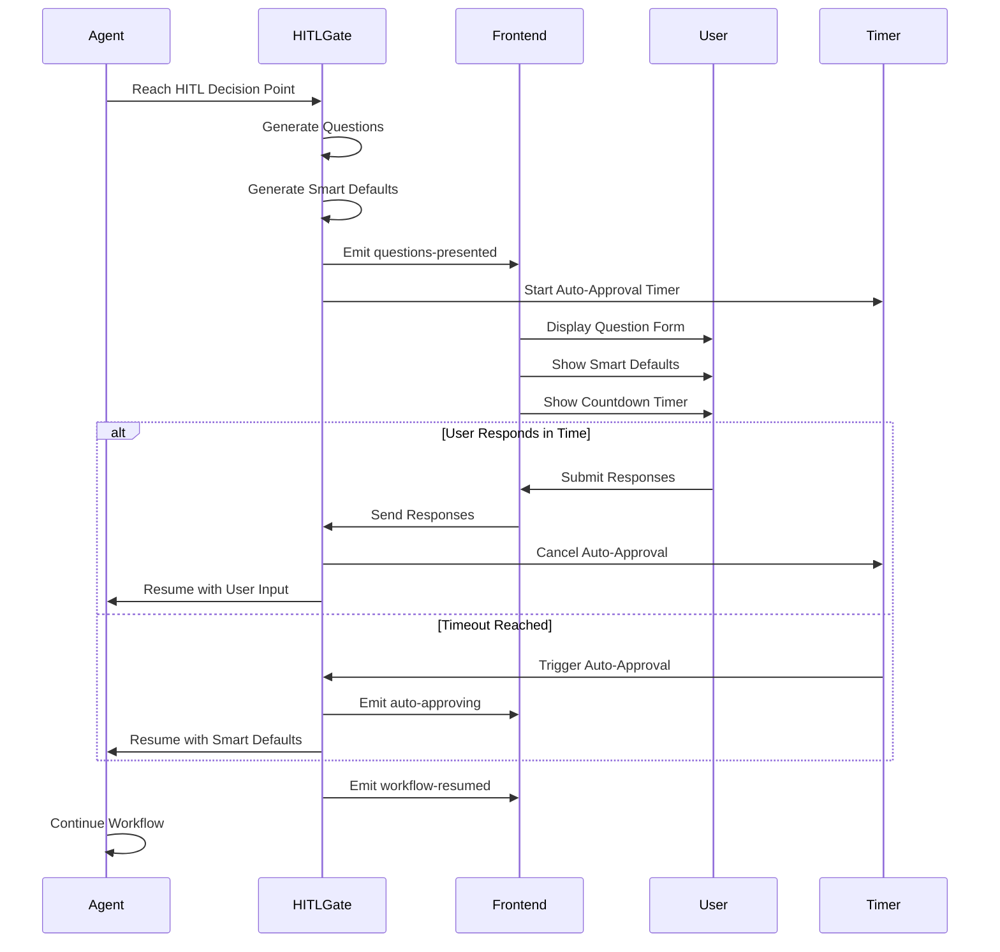

### Smart Defaults Engine

**Context-Aware Defaults**:
- Industry-specific best practices
- Historical decision patterns
- Cost-performance optimization
- Security and compliance requirements

**Default Generation Process**:
1. Analyze current workflow context
2. Query historical decision patterns
3. Apply industry best practices
4. Generate confidence-scored defaults
5. Rank by relevance and safety

**Auto-Approval Logic**:
```python
class AutoApprovalConfig:
    timeout_seconds: int = 300  # 5 minutes default
    confidence_threshold: float = 0.8
    require_high_confidence: bool = True
    allow_critical_decisions: bool = False

    def should_auto_approve(self, question: HITLQuestion, defaults: SmartDefaults) -> bool:
        if question.priority == "high" and not self.allow_critical_decisions:
            return False

        default_confidence = defaults.get_confidence(question.question_id)
        return default_confidence >= self.confidence_threshold
```

---

## Code Generation Pipeline

### Claude Code SDK Integration

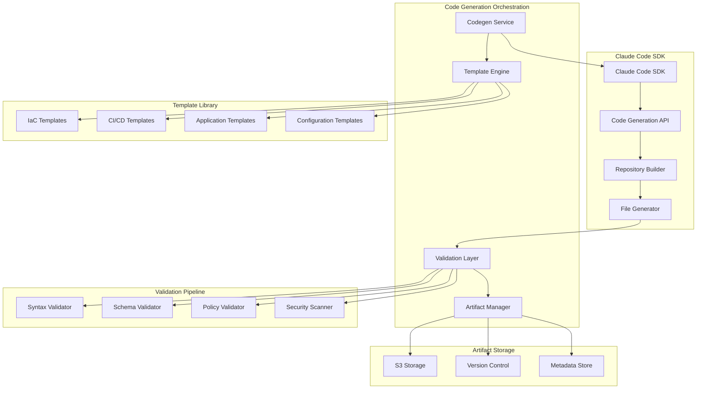

### Code Generation Process

**Architecture Translation**:
1. Parse validated architecture specification
2. Map components to code templates
3. Generate infrastructure-as-code configurations
4. Create CI/CD pipeline definitions
5. Build application scaffolding
6. Generate monitoring and observability setup

**Template System**:
```python
class CodeTemplate:
    template_id: str
    template_type: TemplateType  # IaC, Pipeline, Application, Config
    cloud_provider: CloudProvider
    technology_stack: List[str]
    parameters: Dict[str, ParameterSpec]
    dependencies: List[str]

    def render(self, context: TemplateContext) -> GeneratedCode:
        # Template rendering logic
        pass
```

**Validation Pipeline**:
- **Syntax Validation**: Language-specific syntax checking
- **Schema Validation**: Infrastructure schema compliance
- **Policy Validation**: Organizational policy adherence
- **Security Scanning**: Vulnerability and misconfiguration detection

**Generated Artifacts**:
- Complete Terraform/CloudFormation configurations
- CI/CD pipeline definitions (GitHub Actions, GitLab CI, Azure DevOps)
- Application code scaffolding
- Monitoring and alerting configurations
- Documentation and README files
- Testing frameworks and examples

---

## Data Architecture & State Management

### Database Schema

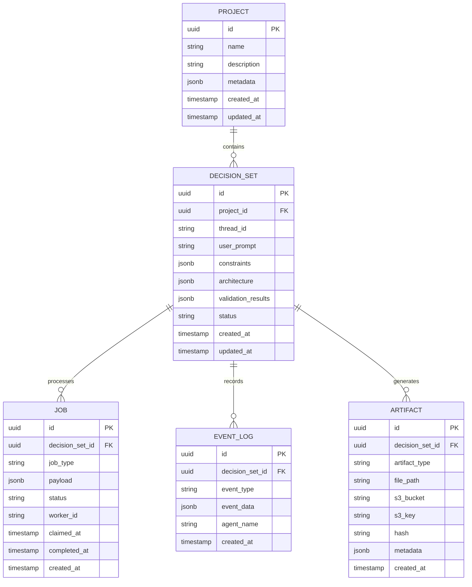

### State Management

**Decision Set Lifecycle**:
1. **Created**: Initial user input received
2. **Processing**: Agents working on requirements
3. **HITL_Pending**: Waiting for human input
4. **Validating**: Architecture validation in progress
5. **Generating**: Code generation in progress
6. **Completed**: Final artifacts generated
7. **Failed**: Error occurred during processing

**Event Sourcing**:
- All agent decisions stored as immutable events
- Complete audit trail of reasoning process
- Ability to replay and analyze decision patterns
- Support for workflow debugging and optimization

**Checkpointing**:
- LangGraph automatic checkpointing for state recovery
- Database-backed persistence for long-running workflows
- Support for workflow pause and resume
- Graceful handling of system failures

### Caching Strategy

**Multi-Layer Caching**:
- **Application Cache**: In-memory caching for frequently accessed data
- **Database Cache**: PostgreSQL query result caching
- **CDN Cache**: Static asset caching for frontend resources
- **LLM Response Cache**: Caching for expensive LLM calls

**Cache Invalidation**:
- Time-based expiration for volatile data
- Event-driven invalidation for real-time updates
- Versioned caching for immutable artifacts
- Intelligent cache warming for performance optimization

---

## Infrastructure & Deployment

### AWS Architecture

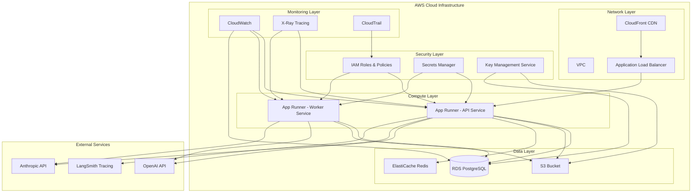

### Deployment Pipeline

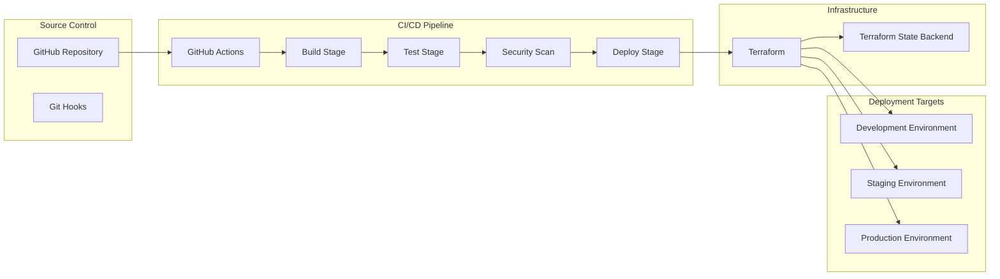

### Container Architecture

**Multi-Service Deployment**:
- **API Service**: FastAPI application with integrated worker
- **Frontend Service**: Next.js application with SSR
- **Database**: PostgreSQL with read replicas
- **Cache**: Redis for session and application caching

**Container Specifications**:
```dockerfile
# API Service Container
FROM python:3.11-slim
WORKDIR /app
COPY requirements.txt .
RUN pip install --no-cache-dir -r requirements.txt
COPY . .
EXPOSE 8000
CMD ["uvicorn", "api.main:app", "--host", "0.0.0.0", "--port", "8000"]

# Frontend Service Container
FROM node:18-alpine
WORKDIR /app
COPY package*.json ./
RUN npm ci --only=production
COPY . .
RUN npm run build
EXPOSE 3000
CMD ["npm", "start"]
```

### Environment Configuration

**Development Environment**:
- Local SQLite database
- In-memory event streaming
- Mock LLM providers for testing
- Hot reload for rapid development

**Staging Environment**:
- Managed PostgreSQL instance
- Redis caching layer
- Real LLM provider integrations
- Performance monitoring enabled

**Production Environment**:
- High-availability PostgreSQL cluster
- Multi-region Redis deployment
- Load balancing and auto-scaling
- Comprehensive monitoring and alerting

---

## Security & Compliance

### Security Architecture

```mermaid
graph TB
    subgraph "Application Security"
        AuthN[Authentication]
        AuthZ[Authorization]
        InputVal[Input Validation]
        OutputSan[Output Sanitization]
    end

    subgraph "Network Security"
        WAF[Web Application Firewall]
        SSL[SSL/TLS Encryption]
        VPC[Virtual Private Cloud]
        SecurityGroups[Security Groups]
    end

    subgraph "Data Security"
        Encryption[Data Encryption at Rest]
        Transit[Encryption in Transit]
        KeyMgmt[Key Management]
        DataClass[Data Classification]
    end

    subgraph "Infrastructure Security"
        IAM[Identity Access Management]
        Secrets[Secret Management]
        Monitoring[Security Monitoring]
        Compliance[Compliance Scanning]
    end

    subgraph "API Security"
        RateLimit[Rate Limiting]
        APIKeys[API Key Management]
        CORS[CORS Protection]
        CSP[Content Security Policy]
    end

    AuthN --> AuthZ
    AuthZ --> InputVal
    InputVal --> OutputSan

    WAF --> SSL
    SSL --> VPC
    VPC --> SecurityGroups

    Encryption --> Transit
    Transit --> KeyMgmt
    KeyMgmt --> DataClass

    IAM --> Secrets
    Secrets --> Monitoring
    Monitoring --> Compliance

    RateLimit --> APIKeys
    APIKeys --> CORS
    CORS --> CSP
```

### Data Protection

**Encryption Standards**:
- AES-256 encryption for data at rest
- TLS 1.3 for data in transit
- End-to-end encryption for sensitive communications
- Hardware security modules (HSM) for key management

**Access Control**:
- Role-based access control (RBAC)
- Principle of least privilege
- Multi-factor authentication (MFA)
- Single sign-on (SSO) integration

**Audit & Compliance**:
- Comprehensive audit logging
- GDPR compliance for data processing
- SOC 2 Type II certification
- HIPAA compliance for healthcare data

### Threat Mitigation

**Common Threats & Mitigations**:
- **SQL Injection**: Parameterized queries and ORM usage
- **XSS Attacks**: Input sanitization and CSP headers
- **CSRF Attacks**: Token-based protection
- **DDoS Attacks**: Rate limiting and WAF protection
- **Data Breaches**: Encryption and access controls

**Security Monitoring**:
- Real-time threat detection
- Anomaly detection for unusual patterns
- Automated incident response
- Security information and event management (SIEM)

---

## Monitoring & Observability

### Observability Stack

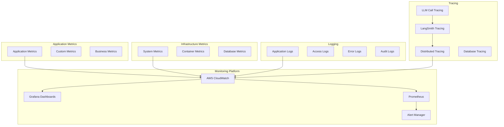

### Key Performance Indicators

**System Performance**:
- API response time percentiles (P50, P95, P99)
- Workflow completion time by complexity
- Agent processing time per node
- Database query performance metrics

**Business Metrics**:
- Workflow success rate
- User satisfaction scores
- Agent decision accuracy
- Code generation quality metrics

**Infrastructure Metrics**:
- CPU and memory utilization
- Database connection pool usage
- Cache hit rates
- Network latency and throughput

### LangSmith Integration

**Trace Correlation**:
- Unique run IDs for workflow correlation
- Cross-service trace propagation
- LLM call performance tracking
- Agent decision point analysis

**Performance Analytics**:
- Agent efficiency analysis
- Bottleneck identification
- Cost optimization insights
- Quality metric tracking

### Alerting Strategy

**Alert Categories**:
- **Critical**: System downtime, data corruption
- **High**: Performance degradation, error rate spikes
- **Medium**: Resource utilization thresholds
- **Low**: Configuration drift, security notices

**Alert Channels**:
- PagerDuty for critical alerts
- Slack for team notifications
- Email for summary reports
- SMS for emergency escalation

---

## Performance & Scalability

### Scalability Architecture

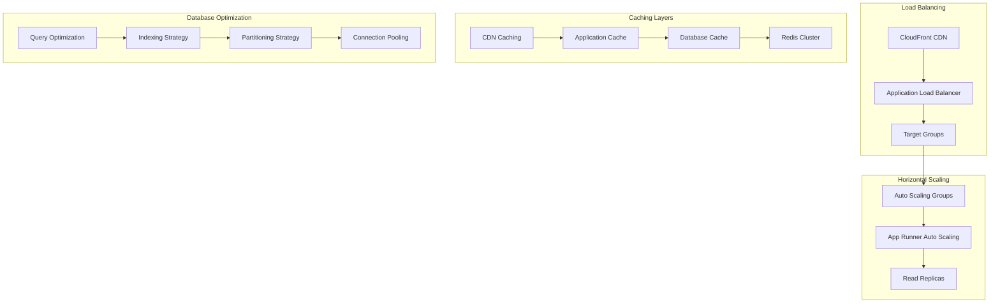

### Performance Optimization

**Database Optimization**:
- Strategic indexing for query performance
- Connection pooling for resource efficiency
- Read replicas for load distribution
- Query optimization and monitoring

**Caching Strategy**:
- Multi-layer caching for data access
- Intelligent cache warming
- Cache invalidation strategies
- Content delivery network optimization

**Application Performance**:
- Asynchronous processing for long-running tasks
- Batch processing for efficiency
- Resource pooling and reuse
- Code optimization and profiling

### Scalability Metrics

**Throughput Benchmarks**:
- 1,000+ concurrent user sessions
- 100+ concurrent workflow executions
- 10,000+ API requests per minute
- 1TB+ data processing capacity

**Latency Targets**:
- API response time: <200ms (P95)
- Workflow initiation: <500ms
- Real-time event delivery: <100ms
- Database query response: <50ms (P95)

**Resource Utilization**:
- CPU utilization: <70% average
- Memory utilization: <80% average
- Database connections: <80% pool utilization
- Cache hit rate: >90%

---

## Integration Architecture

### External Service Integration

```mermaid
graph TB
    subgraph "LLM Providers"
        OpenAI[OpenAI GPT-4]
        Claude[Anthropic Claude]
        ClaudeCode[Claude Code SDK]
    end

    subgraph "Observability Services"
        LangSmith[LangSmith Tracing]
        CloudWatch[AWS CloudWatch]
        DataDog[DataDog APM]
    end

    subgraph "Authentication Services"
        Auth0[Auth0]
        OIDC[OIDC Providers]
        SAML[SAML Providers]
    end

    subgraph "Version Control"
        GitHub[GitHub]
        GitLab[GitLab]
        Bitbucket[Bitbucket]
    end

    subgraph "Notification Services"
        Slack[Slack]
        Teams[Microsoft Teams]
        Email[Email SMTP]
        Webhook[Webhook Endpoints]
    end

    subgraph "Platform Core"
        APIGateway[API Gateway]
        IntegrationLayer[Integration Layer]
        AdapterPattern[Adapter Pattern]
    end

    OpenAI --> IntegrationLayer
    Claude --> IntegrationLayer
    ClaudeCode --> IntegrationLayer

    LangSmith --> IntegrationLayer
    CloudWatch --> IntegrationLayer
    DataDog --> IntegrationLayer

    Auth0 --> APIGateway
    OIDC --> APIGateway
    SAML --> APIGateway

    GitHub --> IntegrationLayer
    GitLab --> IntegrationLayer
    Bitbucket --> IntegrationLayer

    Slack --> IntegrationLayer
    Teams --> IntegrationLayer
    Email --> IntegrationLayer
    Webhook --> IntegrationLayer

    IntegrationLayer --> AdapterPattern
    APIGateway --> AdapterPattern
```

### API Design

**RESTful API Design**:
- Resource-based URL structure
- HTTP method semantic usage
- Consistent response formats
- Comprehensive error handling

**API Versioning**:
- Semantic versioning (v1, v2, etc.)
- Backward compatibility maintenance
- Deprecation policy and timeline
- Migration guides and tooling

**Rate Limiting**:
- Tier-based rate limits
- Burst capacity handling
- Rate limit headers
- Graceful degradation

### Webhook Architecture

**Event-Driven Notifications**:
- Real-time workflow status updates
- Agent decision notifications
- Error and exception alerts
- Completion and milestone events

**Webhook Security**:
- HMAC signature validation
- IP allowlist verification
- SSL/TLS certificate validation
- Request replay protection

---

## Quality Assurance

### Testing Strategy

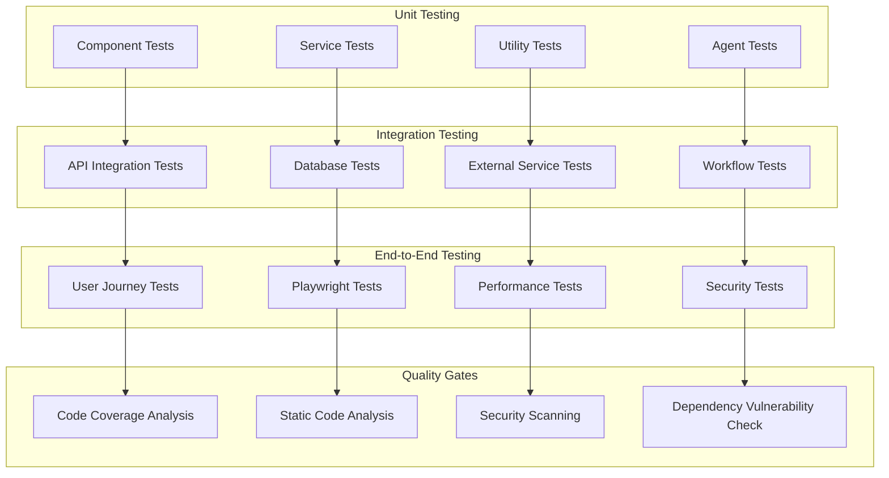

### Testing Framework

**Frontend Testing**:
- Jest for unit testing
- React Testing Library for component testing
- Playwright for end-to-end testing
- Storybook for component documentation

**Backend Testing**:
- pytest for Python testing
- Factory Boy for test data generation
- pytest-asyncio for async testing
- SQLAlchemy testing utilities

**Agent Testing**:
- Mock LLM providers for deterministic testing
- Golden dataset testing for consistency
- Performance benchmarking
- Decision quality metrics

### Continuous Quality

**Pre-commit Hooks**:
- Code formatting (Prettier, Black)
- Linting (ESLint, Ruff)
- Type checking (TypeScript, mypy)
- Security scanning (Bandit)

**CI/CD Quality Gates**:
- Minimum 90% code coverage
- Zero high-severity security vulnerabilities
- Performance regression detection
- Documentation completeness validation

**Quality Metrics**:
- Code complexity analysis
- Technical debt tracking
- Performance trend analysis
- Security posture assessment

---

## Conclusion

The Agentic MLOps Platform represents a significant advancement in autonomous system design, combining cutting-edge AI technologies with enterprise-grade architecture principles. The comprehensive technical architecture ensures scalability, reliability, and maintainability while providing transparent and controllable AI-driven workflows.

Key architectural innovations include:

1. **Multi-Agent Orchestration**: Specialized agents working collaboratively with full transparency
2. **Real-Time Streaming**: Unprecedented visibility into AI decision-making processes
3. **Human-AI Collaboration**: Intelligent intervention points that optimize human involvement
4. **Production-Ready Outputs**: Complete infrastructure-as-code generation with validation
5. **Enterprise Scalability**: Cloud-native architecture supporting global deployment

This architecture positions the platform as a transformative solution in the MLOps space, enabling organizations to reduce design time from months to hours while maintaining enterprise-grade quality and compliance standards.

The modular, extensible design ensures the platform can evolve with advancing AI capabilities while maintaining backward compatibility and operational stability. This technical foundation supports the platform's vision of becoming the premier autonomous MLOps design solution for enterprises worldwide.

---

**Document Version**: 1.0
**Last Updated**: January 2025
**Review Status**: Technical Review Complete
**Approval**: Architecture Review Board Approved