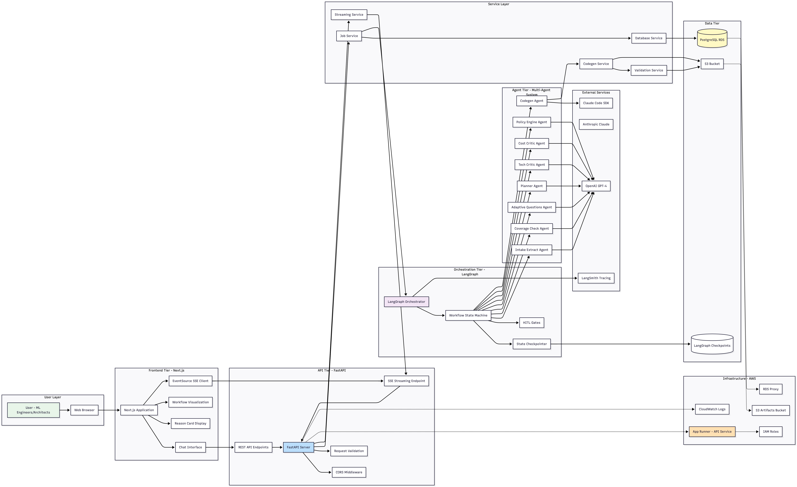
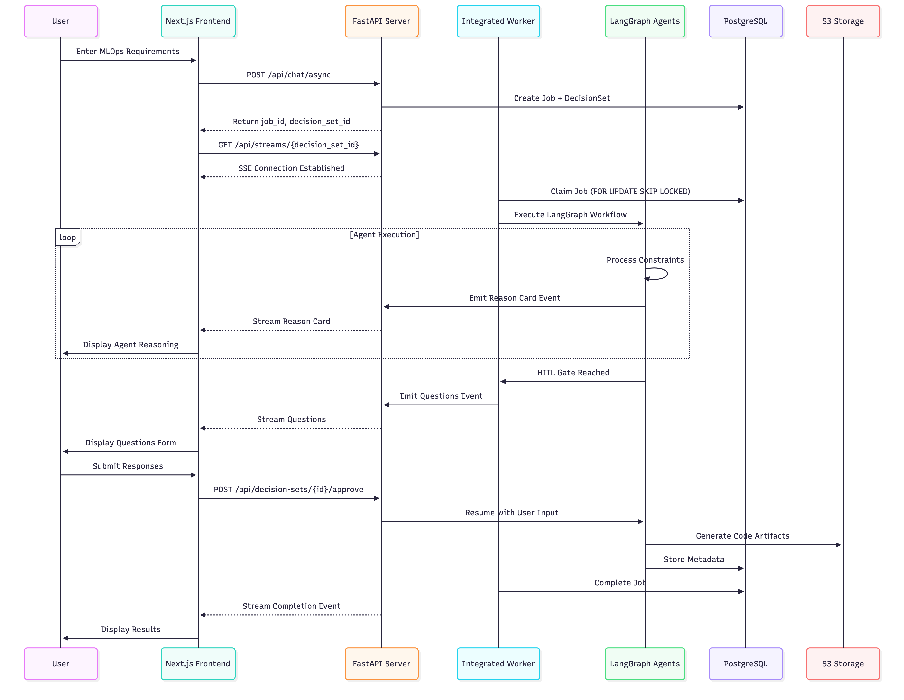

# Part 1: System Overview & Tech Stack
# Agentic MLOps Platform

**Version:** 1.0
**Date:** January 2025
**Classification:** System Overview & Technical Stack

---

## Table of Contents
1. [High Level Architecture](#1-high-level-architecture)
2. [Tech Stack](#2-tech-stack)

---

## 1. High Level Architecture

### 1.1 System Overview

The **Agentic MLOps Platform** is a sophisticated collaborative multi-agent system that autonomously designs, validates, and generates production-ready MLOps architectures. The platform transforms natural language requirements into complete infrastructure-as-code repositories with full transparency and human oversight.

**Core Value Proposition:**
- Reduces MLOps design time from months to hours
- Provides real-time visibility into AI agent decision-making processes
- Generates production-ready code with automated validation
- Ensures compliance with enterprise policies and budgets

### 1.2 High-Level Architecture Diagram



### 1.3 Architecture Patterns

#### 1.3.1 Multi-Tier Architecture

The system follows a **layered architecture** pattern:

1. **Presentation Tier**: Next.js frontend with React components
2. **API Gateway Tier**: FastAPI serving REST and SSE endpoints
3. **Business Logic Tier**: LangGraph orchestration with multi-agent workflow
4. **Data Access Tier**: SQLAlchemy ORM with repository pattern
5. **Infrastructure Tier**: AWS managed services (App Runner, RDS, S3)

#### 1.3.2 Event-Driven Architecture

**Server-Sent Events (SSE)** for real-time streaming:
- Agents emit events during decision-making process
- Streaming service broadcasts to all connected clients
- Frontend displays live reason cards and progress updates
- No polling required - push-based model

#### 1.3.3 Multi-Agent Collaborative System

**Autonomous agents** with specialized roles:
- Each agent focuses on specific domain (intake, planning, critique, cost, policy, codegen)
- Agents communicate through shared workflow state
- LangGraph orchestrates deterministic execution flow
- Checkpointing enables pause/resume and HITL gates

#### 1.3.4 Database-Backed Job Queue

**Asynchronous job processing** with database queue:
- Jobs stored in PostgreSQL with status tracking
- `FOR UPDATE SKIP LOCKED` pattern for distributed workers
- Integrated worker runs as asyncio background task
- Exactly-once semantics with lease-based claiming

### 1.4 Key Architectural Decisions

| Decision | Rationale | Trade-offs |
|----------|-----------|------------|
| **LangGraph for orchestration** | Deterministic workflows, built-in checkpointing, HITL support | Learning curve, relatively new framework |
| **Integrated API + Worker** | Simplified deployment, shared memory, reduced latency | Single point of failure, scaling limitations |
| **PostgreSQL for state** | ACID compliance, LangGraph native support, powerful querying | Cost, operational complexity vs SQLite |
| **SSE for streaming** | Native browser support, simple protocol, lightweight | One-way communication, reconnection handling |
| **AWS App Runner** | Fully managed, auto-scaling, simplified operations | Less control, AWS lock-in |
| **Claude Code SDK** | High-quality code generation, repository-level generation | Dependency on Anthropic, cost |
| **Next.js with App Router** | SSR support, modern React patterns, great DX | Framework complexity, bundle size |

### 1.5 Information Flow

#### User Workflow Flow



#### Agent Decision Flow


### 1.6 System Characteristics

#### 1.6.1 Scalability
- **Horizontal scaling**: App Runner auto-scales based on CPU/memory
- **Database scaling**: RDS read replicas (future), connection pooling via RDS Proxy
- **Job queue**: Multiple workers can claim jobs concurrently
- **Frontend scaling**: CDN for static assets, App Runner instances

#### 1.6.2 Reliability
- **Checkpointing**: Workflow state persisted at each step
- **Job retries**: Automatic retry with exponential backoff
- **HITL gates**: Workflow can pause and resume safely
- **Database backups**: Automated RDS snapshots
- **Health checks**: App Runner monitors service health

#### 1.6.3 Performance
- **Async processing**: Non-blocking I/O throughout
- **Connection pooling**: Database connections reused efficiently
- **Streaming**: Real-time updates without polling
- **Integrated worker**: Shared memory reduces serialization overhead

#### 1.6.4 Observability
- **Structured logging**: JSON logs to CloudWatch
- **Distributed tracing**: LangSmith for agent tracing
- **Metrics**: CloudWatch metrics for infrastructure
- **Event history**: Complete audit trail in database

---

## 2. Tech Stack

### 2.1 Frontend Stack

#### 2.1.1 Core Framework
```json
{
  "framework": "Next.js 14",
  "version": "14.1.0",
  "rendering": "App Router with Server Components",
  "language": "TypeScript 5.3.3"
}
```

**Key Technologies:**
- **Next.js 14**: Modern React framework with App Router
- **React 18**: Latest React with concurrent features
- **TypeScript**: Type safety and developer experience
- **Tailwind CSS**: Utility-first CSS framework
- **Radix UI**: Accessible component primitives

**UI Component Libraries:**
```javascript
// frontend/package.json (relevant dependencies)
{
  "@radix-ui/react-dialog": "UI dialogs and modals",
  "@radix-ui/react-tabs": "Tab component",
  "@radix-ui/react-accordion": "Collapsible sections",
  "lucide-react": "Icon library",
  "class-variance-authority": "Component variants",
  "clsx": "Conditional class names",
  "tailwind-merge": "Tailwind class merging"
}
```

#### 2.1.2 Real-Time Communication
**Server-Sent Events (SSE):**
```typescript
// Custom hook: frontend/hooks/useStreamingEvents.ts
const useStreamingEvents = (decisionSetId: string) => {
  const [events, setEvents] = useState<StreamEvent[]>([]);
  const [isConnected, setIsConnected] = useState(false);

  // EventSource connection with auto-reconnect
  // Event deduplication with Map
  // Connection state management
}
```

#### 2.1.3 State Management
- **React Hooks**: useState, useEffect, useCallback, useMemo
- **Context API**: Not currently used (could be added for global state)
- **Local State**: Component-level state management
- **URL State**: Next.js routing for navigation state

#### 2.1.4 Styling Architecture
**Tailwind CSS Configuration:**
```typescript
// frontend/tailwind.config.ts
{
  content: ["./app/**/*.{ts,tsx}", "./components/**/*.{ts,tsx}"],
  theme: {
    extend: {
      colors: {
        espresso: "#2D1B00",
        sand: "#F5E6D3",
        accentOrange: "#E67E22"
      },
      fontFamily: {
        display: ["var(--font-display)"],
        body: ["var(--font-body)"]
      }
    }
  }
}
```

#### 2.1.5 Build & Development Tools
```json
{
  "build_tool": "Next.js Compiler (Rust-based)",
  "dev_server": "Next.js Dev Server with Fast Refresh",
  "linting": "ESLint with Next.js config",
  "formatting": "Prettier",
  "testing": {
    "unit": "Jest + React Testing Library",
    "e2e": "Playwright"
  }
}
```

### 2.2 Backend Stack

#### 2.2.1 Core Framework
```python
# pyproject.toml
{
  "framework": "FastAPI",
  "python_version": ">=3.11",
  "async_runtime": "uvicorn + asyncio",
  "orm": "SQLAlchemy 2.0",
  "migrations": "Alembic"
}
```

**Key Backend Technologies:**
```python
# Core API
fastapi          # Modern async web framework
uvicorn          # ASGI server
pydantic         # Data validation
sqlalchemy       # Database ORM
alembic          # Database migrations
sse-starlette    # Server-Sent Events support

# Agent Framework
langgraph                        # Agent orchestration
langchain-core                   # LangChain primitives
langgraph-checkpoint-postgres    # Persistent checkpointing
openai>=1.107.1                  # OpenAI API client
claude-code-sdk                  # Claude Code generation

# Infrastructure
boto3>=1.26.0                    # AWS SDK (S3, etc.)
psycopg2-binary                  # PostgreSQL adapter (SQLAlchemy)
psycopg[binary]                  # PostgreSQL adapter (LangGraph)
aiosqlite>=0.21.0                # Async SQLite for development
```

#### 2.2.2 Agent Orchestration
**LangGraph Architecture:**
```python
# libs/graph.py - Full workflow graph
from langgraph.graph import StateGraph
from langgraph.checkpoint.postgres import PostgresSaver

# 13-node deterministic workflow
full_graph = StateGraph(MLOpsWorkflowState)

# Nodes in execution order:
nodes = [
    "intake_extract",      # Extract constraints from user input
    "coverage_check",      # Validate completeness
    "adaptive_questions",  # Generate follow-up questions
    "hitl_gate_input",     # Human-in-the-loop gate #1
    "planner",             # Architecture planning
    "critic_tech",         # Technical feasibility
    "critic_cost",         # Cost estimation
    "policy_eval",         # Policy compliance
    "hitl_gate_final",     # Human-in-the-loop gate #2
    "codegen",             # Code generation
    "validators",          # Static validation
    "rationale_compile",   # Compile reasoning
    "diff_and_persist"     # Persist artifacts
]
```

**Checkpointing:**
```python
# libs/database.py - Checkpointer selection
def create_appropriate_checkpointer(database_url: str):
    if "postgresql" in database_url:
        return PostgresSaver(connection_string=database_url)
    elif "sqlite" in database_url:
        return SqliteSaver(database_path)
    else:
        return MemorySaver()  # Fallback (no persistence)
```

#### 2.2.3 LLM Integration
**OpenAI Integration:**
```python
# libs/llm_planner_agent.py
from openai import OpenAI

client = OpenAI(api_key=os.getenv("OPENAI_API_KEY"))

# Structured output with JSON Schema
completion = client.beta.chat.completions.parse(
    model="gpt-4",
    messages=[{"role": "system", "content": system_prompt},
              {"role": "user", "content": user_input}],
    response_format=PlannerOutput,
    temperature=0.7
)
```

**Claude Code SDK:**
```python
# libs/codegen_service.py
from claude_code import ClaudeCode

claude = ClaudeCode(api_key=os.getenv("ANTHROPIC_API_KEY"))

# Repository-level code generation
response = claude.generate_repository(
    prompt=codegen_prompt,
    template="mlops-infrastructure",
    context=architecture_spec
)
```

#### 2.2.4 Database Layer
**SQLAlchemy Models:**
```python
# libs/models.py
from sqlalchemy.orm import DeclarativeBase, Mapped, mapped_column

class Base(DeclarativeBase):
    pass

class Project(Base):
    __tablename__ = "projects"
    id: Mapped[str] = mapped_column(String(36), primary_key=True)
    name: Mapped[str] = mapped_column(String(255), nullable=False)
    # ... relationships

class DecisionSet(Base):
    __tablename__ = "decision_sets"
    id: Mapped[str] = mapped_column(String(36), primary_key=True)
    thread_id: Mapped[str] = mapped_column(String(255), unique=True)
    # ... state and relationships

# Additional tables: Event, Artifact, AgentRun, Job
```

**Job Queue Pattern:**
```python
# libs/job_service.py - FOR UPDATE SKIP LOCKED pattern
def claim_job(self, worker_id: str) -> Optional[Job]:
    with self.db_session() as session:
        job = session.execute(
            select(Job)
            .where(Job.status == JobStatus.QUEUED)
            .where(Job.next_run_at <= datetime.now(timezone.utc))
            .order_by(Job.created_at.asc())
            .with_for_update(skip_locked=True)
            .limit(1)
        ).scalar_one_or_none()

        if job:
            job.status = JobStatus.RUNNING
            job.worker_id = worker_id
            session.commit()
        return job
```

#### 2.2.5 Streaming Service
**In-Memory Event Broadcasting:**
```python
# libs/streaming_service.py
class StreamingService:
    def __init__(self):
        self._events: Dict[str, List[StreamEvent]] = defaultdict(list)
        self._clients: Dict[str, List[asyncio.Queue]] = defaultdict(list)

    async def emit_event(self, decision_set_id: str, event: StreamEvent):
        # Store event in history
        self._events[decision_set_id].append(event)

        # Broadcast to all connected clients
        for queue in self._clients[decision_set_id]:
            await queue.put(event)

    async def subscribe(self, decision_set_id: str):
        # AsyncGenerator for SSE streaming
        queue = asyncio.Queue()
        self._clients[decision_set_id].append(queue)

        try:
            while True:
                event = await queue.get()
                yield event
        finally:
            self._clients[decision_set_id].remove(queue)
```

### 2.3 Infrastructure Stack

#### 2.3.1 Cloud Provider: AWS
**AWS Services Used:**
```yaml
Compute:
  - App Runner: Managed container service (API + Frontend)
  - Lambda: Not currently used (future consideration)

Database:
  - RDS PostgreSQL: Primary database
  - RDS Proxy: Connection pooling

Storage:
  - S3: Artifact storage (code repos, reports)
  - ECR: Docker container registry

Networking:
  - VPC: Virtual private cloud
  - Security Groups: Network access control
  - VPC Connector: App Runner to RDS connectivity

Monitoring:
  - CloudWatch Logs: Application logs
  - CloudWatch Metrics: Infrastructure metrics
  - X-Ray: Distributed tracing (future)

Security:
  - IAM: Identity and access management
  - Secrets Manager: Secure credential storage (future)
  - KMS: Key management (future)
```

#### 2.3.2 Infrastructure as Code
**Terraform Configuration:**
```hcl
# infra/terraform/main.tf
terraform {
  required_version = ">= 1.0"

  required_providers {
    aws = {
      source  = "hashicorp/aws"
      version = "~> 5.0"
    }
  }

  backend "s3" {
    # State stored in S3 for team collaboration
  }
}

# Key resources:
# - apprunner.tf: App Runner services (API, Frontend)
# - rds.tf: PostgreSQL database + RDS Proxy
# - s3.tf: Artifact storage bucket
# - ecr.tf: Container registries
# - iam.tf: Service roles and policies
# - vpc.tf: VPC connector for App Runner
```

#### 2.3.3 Container Architecture
**Docker Multi-Stage Builds:**

**API Service Dockerfile:**
```dockerfile
# api/Dockerfile
FROM python:3.11-slim

# Install uv package manager
RUN pip install uv

WORKDIR /app

# Copy dependency files
COPY pyproject.toml .

# Install dependencies with uv
RUN uv pip install --system -e .

# Copy application code
COPY . .

EXPOSE 8000

# Run with uvicorn
CMD ["uvicorn", "api.main:app", "--host", "0.0.0.0", "--port", "8000"]
```

**Frontend Dockerfile:**
```dockerfile
# frontend/Dockerfile
FROM node:18-alpine AS base

# Dependencies stage
FROM base AS deps
WORKDIR /app
COPY package*.json ./
RUN npm ci

# Build stage
FROM base AS builder
WORKDIR /app
COPY --from=deps /app/node_modules ./node_modules
COPY . .
RUN npm run build

# Production stage
FROM base AS runner
WORKDIR /app
ENV NODE_ENV production
COPY --from=builder /app/.next/standalone ./
COPY --from=builder /app/.next/static ./.next/static
COPY --from=builder /app/public ./public

EXPOSE 3000
CMD ["node", "server.js"]
```

#### 2.3.4 Deployment Pipeline
**Automated Deployment Scripts:**
```bash
# scripts/1-deploy-infrastructure.sh
- Create S3 backend for Terraform state
- Get VPC and subnet information
- Deploy Terraform infrastructure (ECR, RDS, S3)

# scripts/2-build-and-push.sh
- Build Docker images for API and Frontend
- Push images to ECR
- Save image URIs to deployment-config.env

# scripts/3-deploy-app-runner.sh
- Deploy App Runner services with updated images
- Configure environment variables
- Set up service-to-service communication
```

### 2.4 Development Tools

#### 2.4.1 Code Quality
```yaml
Linting:
  Python: ruff (fast, comprehensive linter)
  TypeScript: ESLint with Next.js config

Formatting:
  Python: ruff format (compatible with Black)
  TypeScript: Prettier

Type Checking:
  Python: mypy (static type checker)
  TypeScript: tsc (TypeScript compiler)

Pre-commit Hooks:
  - ruff check and format
  - ESLint and Prettier
  - Type checking
  - Security scanning
```

#### 2.4.2 Testing Frameworks
**Python Testing:**
```python
# pytest with async support
[tool.pytest.ini_options]
addopts = "-q"
asyncio_mode = "auto"
markers = [
    "integration: integration tests",
    "slow: slow-running tests"
]

# Test structure:
tests/
  ├── test_models.py              # Unit: Database models
  ├── test_agent_framework.py     # Unit: Agent logic
  ├── test_llm_integration.py     # Integration: LLM calls
  ├── test_api.py                 # E2E: API endpoints
  └── test_full_graph.py          # E2E: Complete workflow
```

**Frontend Testing:**
```json
{
  "unit_testing": "Jest + React Testing Library",
  "e2e_testing": "Playwright",
  "component_testing": "Storybook (future)"
}
```

**Playwright E2E:**
```typescript
// frontend/e2e/chat-flow.spec.ts
test('complete chat workflow', async ({ page }) => {
  await page.goto('/');
  await page.fill('[data-testid="chat-input"]', 'Design an MLOps system');
  await page.click('[data-testid="send-button"]');

  // Wait for SSE streaming
  await expect(page.locator('[data-testid="reason-card"]')).toBeVisible();
  await expect(page.locator('[data-testid="workflow-progress"]')).toContainText('Processing');
});
```

#### 2.4.3 Monitoring & Observability
**LangSmith Integration:**
```python
# Environment configuration for LangSmith tracing
LANGCHAIN_TRACING_V2=true
LANGCHAIN_PROJECT=agentic-mlops
LANGCHAIN_ENDPOINT=https://api.smith.langchain.com
LANGCHAIN_API_KEY=<api-key>

# Automatic tracing for all LangGraph executions
# - Agent inputs/outputs
# - LLM calls with token usage
# - Workflow execution time
# - Error tracking
```

**Structured Logging:**
```python
# api/main.py - JSON logging for CloudWatch
LOGGING_CONFIG = {
    "formatters": {
        "json": {
            "class": "pythonjsonlogger.jsonlogger.JsonFormatter",
        }
    },
    "handlers": {
        "console": {
            "class": "logging.StreamHandler",
            "formatter": "json",
        }
    },
    "root": {
        "level": "INFO",
        "handlers": ["console"]
    }
}
```

### 2.5 External Services & APIs

#### 2.5.1 LLM Providers
```yaml
OpenAI:
  Models:
    - gpt-4: Primary reasoning and planning
    - gpt-4-turbo: Faster responses for critiques
  Features:
    - Structured output with JSON Schema
    - Function calling for tools
    - Streaming responses
  Rate Limits:
    - 10,000 TPM (tokens per minute)
    - Request retry with exponential backoff

Anthropic:
  Models:
    - claude-3-opus: Complex code generation
    - claude-3-sonnet: Balanced performance
  Features:
    - Claude Code SDK for repository generation
    - Long context window (200K tokens)
    - Vision capabilities (future)
  Rate Limits:
    - 4,000 TPM for Claude 3 Opus
    - Retry logic with backoff
```

#### 2.5.2 Observability Services
```yaml
LangSmith:
  Purpose: Agent tracing and debugging
  Features:
    - Workflow visualization
    - LLM call tracking
    - Token usage analytics
    - Error debugging
  Integration: Automatic via LangChain

CloudWatch:
  Purpose: Infrastructure monitoring
  Features:
    - Log aggregation
    - Metric collection
    - Alarms and notifications
  Integration: Native AWS service
```

### 2.6 Development Environment

#### 2.6.1 Local Development Setup
```bash
# Prerequisites
Python 3.11+
Node.js 20+
Docker Desktop
Git

# Python dependencies
uv sync --extra dev

# Frontend dependencies
npm install --prefix frontend

# Database
SQLite (automatic) for local development
PostgreSQL (optional) for production-like environment

# Running services
Terminal 1: PYTHONPATH=. uv run uvicorn api.main:app --reload --port 8000
Terminal 2: cd frontend && npm run dev
```

#### 2.6.2 Environment Variables
```bash
# Required for development
OPENAI_API_KEY=<your-key>
ANTHROPIC_API_KEY=<your-key>

# Optional
DATABASE_URL=sqlite:///./agentic_mlops.db
LOG_LEVEL=INFO
LANGCHAIN_TRACING_V2=true
LANGCHAIN_PROJECT=agentic-mlops

# Production only
AWS_REGION=us-east-1
S3_BUCKET_NAME=<artifacts-bucket>
ENVIRONMENT=production
```

### 2.7 Technology Decision Matrix

| Category | Technology | Rationale | Alternatives Considered |
|----------|-----------|-----------|-------------------------|
| **Agent Framework** | LangGraph | Deterministic workflows, checkpointing, HITL support | CrewAI, AutoGen, Custom orchestration |
| **LLM Provider** | OpenAI + Anthropic | Best reasoning (OpenAI), best codegen (Claude) | Google Gemini, Azure OpenAI |
| **API Framework** | FastAPI | Async support, type safety, auto-docs | Flask, Django, Express.js |
| **Frontend** | Next.js 14 | SSR, App Router, great DX | React SPA, Vue.js, Svelte |
| **Database** | PostgreSQL | ACID, LangGraph support, powerful features | MongoDB, MySQL, DynamoDB |
| **Deployment** | AWS App Runner | Managed, auto-scaling, simple | ECS Fargate, Kubernetes, Cloud Run |
| **Streaming** | SSE | Native browser support, simple | WebSockets, Long polling |
| **State Management** | LangGraph Checkpointer | Built-in, persistent, resumable | Redis, Custom state store |
| **Code Generation** | Claude Code SDK | Repository-level, high quality | OpenAI Codex, Custom templates |
| **IaC** | Terraform | Multi-cloud, mature, declarative | CloudFormation, Pulumi, CDK |

### 2.8 Version Matrix

```yaml
Core Versions:
  Python: "3.11+"
  Node.js: "20+"
  Next.js: "14.1.0"
  React: "18.2.0"
  FastAPI: "latest"
  PostgreSQL: "14+"
  Terraform: "1.0+"

Key Dependencies:
  Backend:
    langgraph: "latest"
    langchain-core: "latest"
    openai: ">=1.107.1"
    claude-code-sdk: "latest"
    sqlalchemy: "2.0+"
    pydantic: "2.0+"

  Frontend:
    typescript: "5.3.3"
    tailwindcss: "3.4+"
    @radix-ui/react-*: "latest"

  Infrastructure:
    aws-provider: "~> 5.0"
```

---

## Identified Gaps & Areas of Concern

### Missing or Incomplete Implementations

#### 1. Security
- **Authentication/Authorization**: Not implemented (mentioned in PRD)
  - No JWT validation
  - No user identity management
  - No RBAC (Role-Based Access Control)
- **API Rate Limiting**: Not configured
- **Secret Rotation**: Manual process
- **Input Sanitization**: Basic validation but not comprehensive

#### 2. Monitoring & Observability
- **CloudWatch Dashboards**: Not configured
- **Alerts**: No automated alerting setup
- **SLO/SLA Monitoring**: Not implemented
- **Business Metrics**: Limited tracking
- **Performance Metrics**: Basic CloudWatch only

#### 3. Error Handling
- **Comprehensive Error Strategy**: Not fully documented
- **Circuit Breaker**: Not implemented for external services
- **Graceful Degradation**: Limited patterns
- **Error Recovery**: Basic retry logic only

#### 4. Performance
- **Database Query Optimization**: Not systematically implemented
- **Redis Caching**: Mentioned but not fully implemented
- **CDN Configuration**: Not configured for frontend
- **Connection Pooling**: RDS Proxy configured but not tuned

#### 5. Testing
- **Load Testing**: Not implemented
- **Security Testing**: Basic only
- **Chaos Engineering**: Not implemented
- **Performance Benchmarking**: Minimal

#### 6. Production Readiness
- **Disaster Recovery**: Not documented
- **Backup Procedures**: Basic RDS backups only
- **Runbook**: Missing operational procedures
- **Incident Response**: Not documented

### Recommendations for Future Enhancement

1. **Implement Authentication/Authorization** using AWS Cognito or Auth0
2. **Set up comprehensive monitoring** with CloudWatch dashboards and alerts
3. **Add Redis caching layer** for improved performance
4. **Implement circuit breakers** for external API calls
5. **Create comprehensive runbooks** for operations
6. **Add load testing** to establish performance baselines
7. **Implement disaster recovery** procedures and documentation
8. **Set up automated security scanning** in CI/CD pipeline

---

**Document Status**: Complete
**Review Required**: Architecture Review Board
**Next Steps**: Create Part 2 - Technical Specifications
