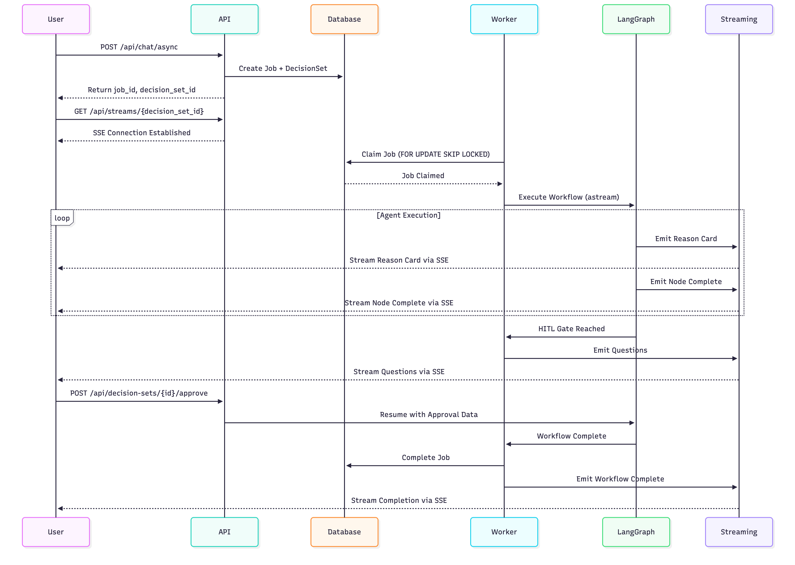

# Part 2: Technical Specifications
# Agentic MLOps Platform

**Version:** 1.0
**Date:** January 2025
**Classification:** Technical Specifications

---

## Table of Contents
1. [Data Models](#1-data-models)
2. [API Specification](#2-api-specification)
3. [Components](#3-components)
4. [External APIs](#4-external-apis)
5. [Core Workflows](#5-core-workflows)
6. [Database Schema](#6-database-schema)

---

## 1. Data Models

### 1.1 Core Domain Models

#### 1.1.1 Project Model
```python
# libs/models.py
class Project(Base):
    """
    A project represents a single MLOps system being designed.
    Each project can have multiple decision sets representing
    different iterations or versions of the design.
    """
    __tablename__ = "projects"

    id: Mapped[str]                    # UUID primary key
    name: Mapped[str]                  # Project name (max 255 chars)
    description: Mapped[Optional[str]] # Detailed description
    created_at: Mapped[datetime]       # UTC timestamp
    updated_at: Mapped[datetime]       # UTC timestamp (auto-updated)

    # Relationships
    decision_sets: Mapped[list[DecisionSet]]  # One-to-many with cascade delete
```

**Usage:**
- Container for all MLOps design iterations
- Supports multi-tenant isolation (future)
- Tracks project lifecycle

#### 1.1.2 DecisionSet Model
```python
class DecisionSet(Base):
    """
    A decision set represents a complete run of the MLOps design process.
    Links to LangGraph thread_id for state persistence and HITL.
    """
    __tablename__ = "decision_sets"

    id: Mapped[str]              # UUID primary key
    project_id: Mapped[str]      # Foreign key to Project
    version: Mapped[int]         # Version for optimistic locking
    thread_id: Mapped[str]       # LangGraph thread_id (unique)
    user_prompt: Mapped[str]     # Original user input
    status: Mapped[str]          # active, completed, failed, cancelled
    created_at: Mapped[datetime]
    updated_at: Mapped[datetime]

    # Relationships
    project: Mapped[Project]
    events: Mapped[list[Event]]
    artifacts: Mapped[list[Artifact]]
    agent_runs: Mapped[list[AgentRun]]
    jobs: Mapped[list[Job]]
```

**Key Features:**
- **Optimistic Locking**: Version field prevents concurrent modification conflicts
- **LangGraph Integration**: thread_id enables checkpoint-based workflow persistence
- **Audit Trail**: All events, artifacts, and agent runs linked to decision set

#### 1.1.3 Job Model
```python
class JobStatus(str, Enum):
    QUEUED = "queued"
    RUNNING = "running"
    COMPLETED = "completed"
    FAILED = "failed"
    CANCELLED = "cancelled"

class Job(Base):
    """
    Jobs represent units of work for asynchronous processing.
    Uses FOR UPDATE SKIP LOCKED pattern for distributed workers.
    """
    __tablename__ = "jobs"

    id: Mapped[str]                        # UUID primary key
    decision_set_id: Mapped[str]           # Foreign key
    job_type: Mapped[str]                  # ml_workflow, codegen, etc.
    priority: Mapped[int]                  # Higher = more urgent
    status: Mapped[JobStatus]              # Current job status
    payload: Mapped[dict]                  # Job-specific data (JSON/JSONB)
    worker_id: Mapped[Optional[str]]       # Claimed by worker
    lease_expires_at: Mapped[Optional[datetime]]  # Lease timeout
    max_retries: Mapped[int]               # Default: 3
    retry_count: Mapped[int]               # Current retry attempt
    error_message: Mapped[Optional[str]]   # Error details if failed
    created_at: Mapped[datetime]
    started_at: Mapped[Optional[datetime]]
    completed_at: Mapped[Optional[datetime]]

    # Relationships
    decision_set: Mapped[DecisionSet]
```

**Job Queue Pattern:**
```python
# libs/job_service.py
def claim_job(self, worker_id: str, lease_duration: int = 5) -> Optional[Job]:
    """
    Claim next available job using FOR UPDATE SKIP LOCKED.
    Ensures exactly-once processing semantics.
    """
    with self.db_session() as session:
        job = session.execute(
            select(Job)
            .where(Job.status == JobStatus.QUEUED)
            .where(Job.next_run_at <= datetime.now(timezone.utc))
            .order_by(Job.priority.desc(), Job.created_at.asc())
            .with_for_update(skip_locked=True)
            .limit(1)
        ).scalar_one_or_none()

        if job:
            job.status = JobStatus.RUNNING
            job.worker_id = worker_id
            job.started_at = datetime.now(timezone.utc)
            job.lease_expires_at = datetime.now(timezone.utc) + timedelta(minutes=lease_duration)
            session.commit()

        return job
```

#### 1.1.4 Event Model
```python
class Event(Base):
    """
    Events track all significant occurrences in the system.
    Provides complete audit trail for compliance and debugging.
    """
    __tablename__ = "events"

    id: Mapped[int]                  # Auto-incrementing integer
    decision_set_id: Mapped[str]     # Foreign key
    event_type: Mapped[str]          # node_start, node_complete, user_action, etc.
    event_data: Mapped[dict]         # Event-specific payload (JSON/JSONB)
    created_at: Mapped[datetime]     # Event timestamp

    # Relationships
    decision_set: Mapped[DecisionSet]
```

**Common Event Types:**
- `node_start`: Agent node begins execution
- `node_complete`: Agent node finishes execution
- `user_action`: User input or approval
- `workflow_paused`: HITL gate reached
- `workflow_resumed`: HITL gate cleared
- `error`: Exception or failure occurred

#### 1.1.5 Artifact Model
```python
class Artifact(Base):
    """
    Artifacts are generated outputs stored in S3.
    Includes code repositories, reports, diagrams, etc.
    """
    __tablename__ = "artifacts"

    id: Mapped[str]                  # UUID primary key
    decision_set_id: Mapped[str]     # Foreign key
    artifact_type: Mapped[str]       # code_repo, report, diagram, etc.
    filename: Mapped[str]            # Original filename
    s3_key: Mapped[str]              # S3 object key
    size_bytes: Mapped[int]          # File size
    content_hash: Mapped[str]        # SHA-256 for integrity verification
    extra_metadata: Mapped[dict]     # Artifact-specific metadata (JSON/JSONB)
    created_at: Mapped[datetime]

    # Relationships
    decision_set: Mapped[DecisionSet]
```

**Artifact Types:**
- `code_repo`: Generated infrastructure-as-code repository (ZIP)
- `validation_report`: Static analysis and validation results
- `cost_report`: Cost estimation with breakdown
- `policy_report`: Policy compliance check results
- `architecture_diagram`: System architecture visualization

#### 1.1.6 AgentRun Model
```python
class AgentRunStatus(str, Enum):
    RUNNING = "running"
    COMPLETED = "completed"
    FAILED = "failed"
    INTERRUPTED = "interrupted"

class AgentRun(Base):
    """
    Tracks individual agent executions within a workflow.
    Useful for performance analysis and debugging.
    """
    __tablename__ = "agent_runs"

    id: Mapped[str]                      # UUID primary key
    decision_set_id: Mapped[str]         # Foreign key
    agent_name: Mapped[str]              # intake_extract, planner, etc.
    status: Mapped[AgentRunStatus]       # Current run status
    input_data: Mapped[dict]             # Agent inputs (JSON/JSONB)
    output_data: Mapped[dict]            # Agent outputs (JSON/JSONB)
    error_message: Mapped[Optional[str]] # Error details if failed
    started_at: Mapped[datetime]
    completed_at: Mapped[Optional[datetime]]
    duration_ms: Mapped[Optional[int]]   # Execution time in milliseconds

    # Relationships
    decision_set: Mapped[DecisionSet]
```

### 1.2 Workflow State Models

#### 1.2.1 MLOpsWorkflowState
```python
# libs/agent_framework.py
class MLOpsWorkflowState(TypedDict, total=False):
    """
    Comprehensive state schema for LangGraph workflows.
    Combines all agent framework state with LangGraph compatibility.
    """
    # LangGraph compatibility
    messages: List[Any]  # Message history for LangGraph

    # Core workflow state
    project_id: Optional[str]
    decision_set_id: Optional[str]
    version: Optional[int]

    # User input and constraints
    constraints: Optional[Dict[str, Any]]              # Extracted requirements
    coverage_score: Optional[float]                    # Completeness score (0.0-1.0)
    missing_fields: Optional[List[str]]                # Required fields not provided

    # Planning outputs
    plan: Optional[Dict[str, Any]]                     # Selected architecture plan
    candidates: Optional[List[Dict[str, Any]]]         # Alternative options considered
    selected_pattern_id: Optional[str]                 # Chosen pattern ID

    # Critics and policy results
    tech_critique: Optional[Dict[str, Any]]            # Technical feasibility analysis
    cost_estimate: Optional[Dict[str, Any]]            # Cost breakdown and totals
    policy_results: Optional[Dict[str, Any]]           # Compliance check results

    # Agent execution tracking
    agent_outputs: Optional[Dict[str, Any]]            # All agent outputs
    reason_cards: Optional[List[Dict[str, Any]]]       # Decision transparency

    # Artifacts and reports
    artifacts: Optional[List[Dict[str, Any]]]          # Generated files
    reports: Optional[Dict[str, Any]]                  # Validation reports

    # Execution metadata
    run_meta: Optional[Dict[str, Any]]                 # Run-level metadata
    last_updated: Optional[str]                        # ISO timestamp
    execution_order: Optional[List[str]]               # Node execution sequence

    # LLM-specific fields for enhanced agent capabilities
    constraint_extraction: Optional[Dict[str, Any]]    # Intake agent output
    coverage_analysis: Optional[Dict[str, Any]]        # Coverage check output
    adaptive_questioning: Optional[Dict[str, Any]]     # Questions generated
    questioning_history: Optional[List[Dict[str, Any]]]  # Q&A history
    questioning_complete: Optional[bool]               # All questions answered
    current_questions: Optional[List[Dict[str, Any]]]  # Pending questions
    planning_analysis: Optional[Dict[str, Any]]        # Planner reasoning
    technical_feasibility_score: Optional[float]       # Tech critic score
    architecture_confidence: Optional[float]           # Overall confidence
    estimated_monthly_cost: Optional[float]            # USD per month
    cost_confidence: Optional[float]                   # Cost estimate confidence
    budget_compliance_status: Optional[str]            # pass/warn/fail
    overall_compliance_status: Optional[str]           # Overall policy status
    compliance_score: Optional[float]                  # 0.0-1.0
    escalation_required: Optional[bool]                # Requires human approval
    policy_validation: Optional[Dict[str, Any]]        # Policy engine output
```

#### 1.2.2 ReasonCard Model
```python
# libs/agent_framework.py
class ReasonCard(BaseModel):
    """
    Structured reason card for transparent agent decision making.
    Streamed to users via SSE for full transparency.
    """
    decision_id: str = Field(default_factory=lambda: str(uuid.uuid4()))
    agent: AgentType                    # Which agent made the decision
    node_name: str                      # LangGraph node name
    trigger: TriggerType                # What triggered this decision
    timestamp: datetime                 # When decision was made

    # Input context
    inputs: Dict[str, Any]              # Input data considered
    constraints_keys: List[str]         # Constraints referenced
    artifacts_consulted: List[str]      # Previous artifacts used

    # Decision process
    candidates: List[CandidateOption]   # Options considered
    choice: DecisionChoice              # Selected option with justification
    alternatives_rejected: List[str]    # Why other options were rejected

    # Policy and impact
    policy_results: List[PolicyResult]  # Policy compliance results
    impact: ImpactAssessment            # Estimated impact (cost, latency, etc.)

    # Confidence and risks
    confidence: float                   # 0.0-1.0 confidence score
    risks: List[str]                    # Identified risks and concerns
    recommendations: List[str]          # Follow-up recommendations

    # Outputs
    outputs: Dict[str, Any]             # Agent outputs
    next_steps: List[str]               # Suggested next actions

    # Metadata
    category: str                       # constraint_extraction, planning, etc.
    priority: str                       # low, medium, high
```

### 1.3 Pydantic Models for API

#### 1.3.1 Chat Request/Response
```python
# api/main.py
class ChatMessage(BaseModel):
    role: Literal["user", "assistant", "system", "tool"]
    content: str

class ChatRequest(BaseModel):
    messages: List[ChatMessage]
    thread_id: Optional[str] = None  # For conversation continuity

class ChatResponse(BaseModel):
    messages: List[ChatMessage]
    thread_id: str  # Always returned for tracking

class AsyncChatResponse(BaseModel):
    decision_set_id: str  # ID for tracking conversation
    thread_id: str        # LangGraph thread_id
    job_id: str          # ID for tracking job status
    status: str          # Current job status (queued, running, etc.)
```

#### 1.3.2 Job Status Models
```python
class JobStatusResponse(BaseModel):
    job_id: str
    status: JobStatus  # Enum: queued, running, completed, failed, cancelled
    decision_set_id: str
    thread_id: str
```

#### 1.3.3 Approval Models
```python
class ApprovalRequest(BaseModel):
    decision: Literal["approved", "rejected"]
    comment: Optional[str] = None
    approved_by: Optional[str] = None

class ApprovalResponse(BaseModel):
    success: bool
    message: str
    decision_set_id: str
    thread_id: str
    approval_status: str  # Status after approval processed
```

### 1.4 Streaming Event Models

```python
# libs/streaming_models.py
class StreamEventType(str, Enum):
    NODE_START = "node-start"
    NODE_COMPLETE = "node-complete"
    REASON_CARD = "reason-card"
    WORKFLOW_PAUSED = "workflow-paused"
    WORKFLOW_RESUMED = "workflow-resumed"
    QUESTIONS_PRESENTED = "questions-presented"
    RESPONSES_COLLECTED = "responses-collected"
    AUTO_APPROVING = "auto-approving"
    COUNTDOWN_TICK = "countdown-tick"
    ERROR = "error"
    HEARTBEAT = "heartbeat"
    WORKFLOW_COMPLETE = "workflow-complete"

class StreamEvent(BaseModel):
    """Base streaming event model for SSE."""
    event_type: StreamEventType
    decision_set_id: str
    timestamp: datetime = Field(default_factory=lambda: datetime.now(timezone.utc))
    data: Dict[str, Any]
    message: Optional[str] = None
```

---

## 2. API Specification

### 2.1 REST Endpoints

#### 2.1.1 Health Check
```http
GET /
```

**Response:**
```json
{
  "message": "Agentic MLOps API"
}
```

#### 2.1.2 Synchronous Chat (Legacy)
```http
POST /api/chat
Content-Type: application/json

{
  "messages": [
    {"role": "user", "content": "Design an MLOps system for real-time fraud detection"}
  ],
  "thread_id": "optional-thread-id"
}
```

**Response:**
```json
{
  "messages": [
    {"role": "user", "content": "Design an MLOps system..."},
    {"role": "assistant", "content": "I'll help design an MLOps system..."}
  ],
  "thread_id": "550e8400-e29b-41d4-a716-446655440000"
}
```

**Notes:**
- Blocks until workflow completes
- Use for testing and backward compatibility
- Production should use async endpoint

#### 2.1.3 Asynchronous Chat (Preferred)
```http
POST /api/chat/async
Content-Type: application/json

{
  "messages": [
    {"role": "user", "content": "Design an MLOps system for batch model training"}
  ],
  "thread_id": "optional-thread-id"
}
```

**Response:**
```json
{
  "decision_set_id": "ds_550e8400-e29b-41d4-a716-446655440000",
  "thread_id": "550e8400-e29b-41d4-a716-446655440000",
  "job_id": "job_123e4567-e89b-12d3-a456-426614174000",
  "status": "queued"
}
```

**Benefits:**
- Returns immediately with job tracking info
- API remains responsive under load
- Enables distributed processing

#### 2.1.4 Job Status Polling
```http
GET /api/jobs/{job_id}/status
```

**Response:**
```json
{
  "job_id": "job_123e4567-e89b-12d3-a456-426614174000",
  "status": "running",
  "decision_set_id": "ds_550e8400-e29b-41d4-a716-446655440000",
  "thread_id": "550e8400-e29b-41d4-a716-446655440000"
}
```

**Status Values:**
- `queued`: Job waiting for worker
- `running`: Job being processed
- `completed`: Job finished successfully
- `failed`: Job encountered error
- `cancelled`: Job was cancelled

#### 2.1.5 SSE Streaming Endpoint
```http
GET /api/streams/{decision_set_id}
Accept: text/event-stream
```

**SSE Event Stream:**
```
event: node-start
data: {"type":"node-start","decision_set_id":"ds_123","timestamp":"2025-01-15T10:30:00Z","data":{"node":"intake_extract","message":"Starting constraint extraction"}}

event: reason-card
data: {"type":"reason-card","decision_set_id":"ds_123","timestamp":"2025-01-15T10:30:15Z","data":{"agent":"intake.extract","node":"intake_extract","reasoning":"Extracted 12 constraints from user input","confidence":0.85,"outputs":{"constraints_count":12}}}

event: node-complete
data: {"type":"node-complete","decision_set_id":"ds_123","timestamp":"2025-01-15T10:30:30Z","data":{"node":"intake_extract","outputs":{},"message":"Completed intake_extract"}}

event: heartbeat
data: {}

event: workflow-complete
data: {"type":"workflow-complete","decision_set_id":"ds_123","timestamp":"2025-01-15T10:35:00Z","data":{"status":"completed","duration_ms":300000}}
```

**Event Types:**
- `node-start`: Agent begins processing
- `node-complete`: Agent finishes processing
- `reason-card`: Agent decision with reasoning
- `workflow-paused`: HITL gate reached
- `workflow-resumed`: HITL gate cleared
- `questions-presented`: Questions for user
- `error`: Error occurred
- `heartbeat`: Connection keepalive (every 10s)
- `workflow-complete`: Workflow finished

#### 2.1.6 HITL Approval
```http
POST /api/decision-sets/{decision_set_id}/approve
Content-Type: application/json

{
  "decision": "approved",
  "comment": "Looks good, proceed with code generation",
  "approved_by": "john@company.com"
}
```

**Response:**
```json
{
  "success": true,
  "message": "Plan approved successfully. Workflow resumed.",
  "decision_set_id": "ds_550e8400-e29b-41d4-a716-446655440000",
  "thread_id": "550e8400-e29b-41d4-a716-446655440000",
  "approval_status": "approved_continuing"
}
```

#### 2.1.7 Workflow Plan
```http
GET /api/workflow/plan
```

**Response:**
```json
{
  "nodes": [
    "intake_extract",
    "coverage_check",
    "adaptive_questions",
    "hitl_gate_input",
    "planner",
    "critic_tech",
    "critic_cost",
    "policy_eval",
    "hitl_gate_final",
    "codegen",
    "validators",
    "rationale_compile",
    "diff_and_persist"
  ],
  "graph_type": "full"
}
```

### 2.2 Error Responses

#### Standard Error Format
```json
{
  "detail": "Human-readable error message"
}
```

**HTTP Status Codes:**
- `400 Bad Request`: Invalid request parameters
- `404 Not Found`: Resource not found (job, decision set)
- `500 Internal Server Error`: Server-side error

#### Example Errors
```json
// Job not found
{
  "detail": "Job not found"
}

// Decision set not found
{
  "detail": "Decision set not found"
}

// Chat processing failed
{
  "detail": "Chat processing failed"
}

// Failed to create job
{
  "detail": "Failed to create job"
}
```

### 2.3 CORS Configuration

**Development:**
```python
allowed_origins = [
    "http://localhost:3000",
    "http://localhost:3001",
    "http://127.0.0.1:3000",
    "http://127.0.0.1:3001",
]
allow_credentials = True
allowed_methods = ["*"]
allowed_headers = ["*"]
```

**Production:**
```python
allowed_origins = [
    "https://*.amazonaws.com",  # AWS App Runner domains
]
allow_credentials = True
allowed_methods = ["GET", "POST", "PUT", "DELETE"]
allowed_headers = ["Content-Type", "Authorization"]
```

---

## 3. Components

### 3.1 Backend Components

#### 3.1.1 Agent Framework Components

**Base Agent Interface:**
```python
# libs/agent_framework.py
class BaseMLOpsAgent(ABC):
    """Abstract base class for all MLOps agents."""

    def __init__(self, agent_type: AgentType):
        self.agent_type = agent_type

    @abstractmethod
    async def execute(
        self, state: MLOpsWorkflowState, trigger: TriggerType
    ) -> AgentResult:
        """Execute agent logic and return result with reason card."""
        pass

    def create_reason_card(
        self,
        node_name: str,
        trigger: TriggerType,
        inputs: Dict[str, Any],
        outputs: Dict[str, Any],
        reasoning: str,
        confidence: float,
        **kwargs
    ) -> ReasonCard:
        """Helper to create structured reason cards."""
        return ReasonCard(
            agent=self.agent_type,
            node_name=node_name,
            trigger=trigger,
            inputs=inputs,
            outputs=outputs,
            reasoning=reasoning,
            confidence=confidence,
            **kwargs
        )
```

**Specialized Agents:**

1. **IntakeExtractAgent** ([intake_extract_agent.py](libs/intake_extract_agent.py))
   - Parses natural language requirements
   - Extracts structured constraints
   - Uses OpenAI structured output
   - Returns constraint schema

2. **CoverageCheckAgent** ([coverage_check_agent.py](libs/coverage_check_agent.py))
   - Computes completeness score (0.0-1.0)
   - Identifies missing/ambiguous fields
   - Determines if threshold met (default: 0.7)

3. **AdaptiveQuestionsAgent** ([adaptive_questions_agent.py](libs/adaptive_questions_agent.py))
   - Generates follow-up questions
   - Provides smart default answers
   - Prioritizes critical gaps

4. **LLMPlannerAgent** ([llm_planner_agent.py](libs/llm_planner_agent.py))
   - Composes architecture from capability patterns
   - Evaluates multiple candidates
   - Selects optimal design with justification

5. **LLMTechCriticAgent** ([llm_tech_critic_agent.py](libs/llm_tech_critic_agent.py))
   - Assesses technical feasibility
   - Identifies bottlenecks and risks
   - Scores architecture confidence

6. **LLMCostCriticAgent** ([llm_cost_critic_agent.py](libs/llm_cost_critic_agent.py))
   - Generates bill of materials (BOM)
   - Estimates monthly costs (USD)
   - Checks budget compliance

7. **LLMPolicyEngineAgent** ([llm_policy_engine_agent.py](libs/llm_policy_engine_agent.py))
   - Validates against governance rules
   - Checks compliance (GDPR, HIPAA, etc.)
   - Escalates policy violations

#### 3.1.2 Service Layer Components

**JobService:**
```python
# libs/job_service.py
class JobService:
    """Service for managing async job queue operations."""

    def __init__(self, session: Session):
        self.session = session

    def create_job(
        self,
        decision_set_id: str,
        job_type: str,
        payload: Dict[str, Any],
        priority: int = 0
    ) -> Job:
        """Create and enqueue a new job."""

    def claim_job(self, worker_id: str, lease_duration: int = 5) -> Optional[Job]:
        """Claim next available job using FOR UPDATE SKIP LOCKED."""

    def complete_job(self, job_id: str, worker_id: str) -> bool:
        """Mark job as completed."""

    def fail_job(self, job_id: str, worker_id: str, error_message: str) -> bool:
        """Mark job as failed with retry logic."""
```

**StreamingService:**
```python
# libs/streaming_service.py
class StreamingService:
    """Service for real-time SSE event broadcasting."""

    def __init__(self):
        self._events: Dict[str, List[StreamEvent]] = defaultdict(list)
        self._clients: Dict[str, List[asyncio.Queue]] = defaultdict(list)

    async def emit_event(self, event: StreamEvent):
        """Broadcast event to all subscribed clients."""

    async def emit_reason_card(self, reason_card: ReasonCard):
        """Emit agent reason card event."""

    async def emit_node_start(self, decision_set_id: str, node_name: str, message: str = ""):
        """Emit node start event."""

    async def emit_node_complete(self, decision_set_id: str, node_name: str, outputs: Dict, message: str = ""):
        """Emit node completion event."""

    async def subscribe(self, decision_set_id: str) -> AsyncGenerator[StreamEvent, None]:
        """Subscribe to event stream for a decision set."""

    def get_events(self, decision_set_id: str) -> List[StreamEvent]:
        """Get historical events for a decision set."""
```

**CodegenService:**
```python
# libs/codegen_service.py
class CodegenService:
    """Service for generating code using Claude Code SDK."""

    def __init__(self, claude_api_key: str, s3_client: boto3.client):
        self.claude = ClaudeCode(api_key=claude_api_key)
        self.s3 = s3_client

    async def generate_repository(
        self,
        architecture_spec: Dict[str, Any],
        decision_set_id: str
    ) -> Artifact:
        """Generate complete IaC repository using Claude Code SDK."""

    async def upload_to_s3(
        self,
        file_content: bytes,
        filename: str,
        decision_set_id: str
    ) -> str:
        """Upload artifact to S3 and return S3 key."""
```

**ValidationService:**
```python
# libs/validation_service.py
class ValidationService:
    """Service for validating generated code."""

    async def validate_terraform(self, repo_path: str) -> ValidationReport:
        """Run terraform validate and format checks."""

    async def validate_python(self, repo_path: str) -> ValidationReport:
        """Run ruff linting on Python code."""

    async def validate_ci_pipelines(self, repo_path: str) -> ValidationReport:
        """Validate CI/CD pipeline definitions."""

    async def generate_report(self, validations: List[ValidationReport]) -> Dict:
        """Compile all validation results into comprehensive report."""
```

#### 3.1.3 Worker Components

**IntegratedWorkerService:**
```python
# api/main.py
class IntegratedWorkerService:
    """
    Integrated worker that runs in the same process as API.
    Provides job persistence benefits without separate worker processes.
    """

    def __init__(self, worker_id: str = None, poll_interval: int = 5):
        self.worker_id = worker_id or f"worker-{uuid.uuid4().hex[:8]}"
        self.poll_interval = poll_interval
        self.running = False
        self.graph = _graph  # Share graph instance with API

    async def start_background_worker(self):
        """Start worker as background asyncio task."""

    async def run_worker_loop(self):
        """Main worker loop with exponential backoff."""

    async def process_next_job(self) -> bool:
        """Claim and process next available job."""

    async def process_ml_workflow_job(self, job: Job):
        """Execute LangGraph workflow for ML design job."""
```

### 3.2 Frontend Components

#### 3.2.1 Chat Components

**EnhancedChatInterface:**
```typescript
// frontend/components/chat/enhanced-chat-interface.tsx
interface Message {
  role: 'user' | 'assistant';
  content: string;
  timestamp: Date;
  jobStatus?: 'queued' | 'running' | 'completed' | 'failed';
}

export function EnhancedChatInterface() {
  const [messages, setMessages] = useState<Message[]>([]);
  const [input, setInput] = useState('');
  const [isLoading, setIsLoading] = useState(false);
  const [jobId, setJobId] = useState<string | null>(null);
  const [decisionSetId, setDecisionSetId] = useState<string | null>(null);

  const handleSendMessage = async () => {
    // POST /api/chat/async
    // Start SSE subscription
    // Poll job status
  };

  return (
    <div className="flex flex-col h-full">
      <MessageList messages={messages} />
      <MessageInput value={input} onChange={setInput} onSend={handleSendMessage} />
    </div>
  );
}
```

#### 3.2.2 Streaming Components

**WorkflowVisualization:**
```typescript
// frontend/components/streaming/workflow-visualization.tsx
interface WorkflowVisualizationProps {
  decisionSetId: string;
  mode?: 'static' | 'live';
}

export function WorkflowVisualization({ decisionSetId, mode = 'live' }: WorkflowVisualizationProps) {
  const { events, isConnected } = useStreamingEvents(decisionSetId);
  const [reasonCards, setReasonCards] = useState<ReasonCard[]>([]);
  const [completedNodes, setCompletedNodes] = useState<Set<string>>(new Set());

  useEffect(() => {
    events.forEach(event => {
      if (event.type === 'reason-card') {
        setReasonCards(prev => [...prev, event.data]);
      } else if (event.type === 'node-complete') {
        setCompletedNodes(prev => new Set([...prev, event.data.node]));
      }
    });
  }, [events]);

  return (
    <div className="workflow-container">
      <WorkflowProgress completedNodes={completedNodes} totalNodes={13} />
      <ReasonCardList reasonCards={reasonCards} />
      {!isConnected && <ConnectionWarning />}
    </div>
  );
}
```

**ReasonCard:**
```typescript
// frontend/components/streaming/reason-card.tsx
interface ReasonCardProps {
  agent: string;
  node: string;
  reasoning: string;
  decision: string;
  confidence: number;
  inputs: Record<string, any>;
  outputs: Record<string, any>;
  timestamp: string;
}

export function ReasonCard({ agent, reasoning, confidence, inputs, outputs }: ReasonCardProps) {
  const [isExpanded, setIsExpanded] = useState(false);

  return (
    <div className="reason-card border rounded-lg p-4">
      <div className="flex justify-between items-start">
        <div className="flex-1">
          <h4 className="font-semibold">{agent}</h4>
          <p className="text-sm text-gray-600">{reasoning}</p>
        </div>
        <Badge variant={confidence > 0.8 ? 'success' : 'warning'}>
          {(confidence * 100).toFixed(0)}% confident
        </Badge>
      </div>

      {isExpanded && (
        <div className="mt-4 space-y-2">
          <CollapsibleSection title="Inputs" content={inputs} />
          <CollapsibleSection title="Outputs" content={outputs} />
        </div>
      )}

      <button onClick={() => setIsExpanded(!isExpanded)} className="mt-2 text-sm text-blue-600">
        {isExpanded ? 'Show less' : 'Show more'}
      </button>
    </div>
  );
}
```

#### 3.2.3 Custom Hooks

**useStreamingEvents:**
```typescript
// frontend/hooks/useStreamingEvents.ts
interface UseStreamingEventsOptions {
  decisionSetId: string;
  autoConnect?: boolean;
}

interface StreamEvent {
  type: string;
  decision_set_id: string;
  timestamp: string;
  data: any;
  message?: string;
}

export function useStreamingEvents({ decisionSetId, autoConnect = true }: UseStreamingEventsOptions) {
  const [events, setEvents] = useState<StreamEvent[]>([]);
  const [isConnected, setIsConnected] = useState(false);
  const [error, setError] = useState<string | null>(null);
  const eventSourceRef = useRef<EventSource | null>(null);

  useEffect(() => {
    if (!autoConnect || !decisionSetId) return;

    const apiBaseUrl = process.env.NEXT_PUBLIC_API_BASE_URL || 'http://localhost:8000';
    const eventSource = new EventSource(`${apiBaseUrl}/api/streams/${decisionSetId}`);

    eventSource.onopen = () => setIsConnected(true);
    eventSource.onerror = () => setIsConnected(false);

    // Listen for all event types
    ['reason-card', 'node-start', 'node-complete', 'workflow-complete', 'error'].forEach(eventType => {
      eventSource.addEventListener(eventType, (e) => {
        const event = JSON.parse(e.data);
        setEvents(prev => [...prev, event]);
      });
    });

    eventSourceRef.current = eventSource;

    return () => eventSource.close();
  }, [decisionSetId, autoConnect]);

  return { events, isConnected, error };
}
```

---

## 4. External APIs

### 4.1 OpenAI API

**Purpose:** Primary LLM for agent reasoning and planning

**Models Used:**
- `gpt-4`: Complex reasoning, planning, critiques
- `gpt-4-turbo`: Faster responses for less complex tasks

**Integration:**
```python
# libs/llm_planner_agent.py
from openai import OpenAI

client = OpenAI(api_key=os.getenv("OPENAI_API_KEY"))

completion = client.beta.chat.completions.parse(
    model="gpt-4",
    messages=[
        {"role": "system", "content": system_prompt},
        {"role": "user", "content": user_input}
    ],
    response_format=PlannerOutput,  # Pydantic model
    temperature=0.7
)
```

**Features Used:**
- Structured output with JSON Schema validation
- Temperature control for consistency
- Retry logic with exponential backoff

**Rate Limits:**
- 10,000 tokens per minute (TPM)
- Automatic retry with backoff on 429 errors

### 4.2 Anthropic Claude API

**Purpose:** Code generation via Claude Code SDK

**Models Used:**
- `claude-3-opus`: Complex repository generation
- `claude-3-sonnet`: Balanced performance for code tasks

**Integration:**
```python
# libs/codegen_service.py
from claude_code import ClaudeCode

claude = ClaudeCode(api_key=os.getenv("ANTHROPIC_API_KEY"))

response = claude.generate_repository(
    prompt=codegen_prompt,
    template="mlops-infrastructure",
    context={
        "architecture": architecture_spec,
        "constraints": constraints,
        "tech_stack": tech_stack
    }
)
```

**Features:**
- Repository-level code generation
- Multi-file artifact creation
- Context window: 200K tokens

**Rate Limits:**
- 4,000 TPM for Claude 3 Opus
- Retry logic implemented

### 4.3 LangSmith API

**Purpose:** Agent tracing and observability

**Integration:**
```python
# Environment variables
LANGCHAIN_TRACING_V2=true
LANGCHAIN_PROJECT=agentic-mlops
LANGCHAIN_API_KEY=<api-key>
LANGCHAIN_ENDPOINT=https://api.smith.langchain.com
```

**Features:**
- Automatic tracing of LangGraph executions
- Agent input/output capture
- Token usage tracking
- Error tracking and debugging
- Run correlation with run_id

**Data Captured:**
- Workflow execution traces
- LLM call details (model, tokens, latency)
- Agent decision points
- Error stack traces

### 4.4 AWS Services

**S3 - Artifact Storage:**
```python
import boto3

s3_client = boto3.client('s3', region_name=os.getenv('AWS_REGION', 'us-east-1'))

# Upload artifact
s3_client.put_object(
    Bucket=os.getenv('S3_BUCKET_NAME'),
    Key=f'decision-sets/{decision_set_id}/artifacts/{artifact_id}.zip',
    Body=artifact_content,
    ServerSideEncryption='AES256'
)
```

**RDS PostgreSQL:**
- Accessed via DATABASE_URL connection string
- Connection pooling via RDS Proxy
- Automated backups and snapshots

**CloudWatch Logs:**
- Structured JSON logging in production
- Log groups per service
- Automatic retention policies

---

## 5. Core Workflows

### 5.1 Full MLOps Design Workflow

**13-Node LangGraph Workflow:**

```python
# libs/graph.py
def build_full_graph() -> Pregel:
    """Build complete 13-node workflow with dual HITL gates."""

    graph = StateGraph(MLOpsWorkflowState)

    # Add nodes
    graph.add_node("intake_extract", intake_extract)
    graph.add_node("coverage_check", coverage_check)
    graph.add_node("adaptive_questions", adaptive_questions)
    graph.add_node("hitl_gate_input", hitl_gate_input)
    graph.add_node("planner", planner)
    graph.add_node("critic_tech", critic_tech)
    graph.add_node("critic_cost", critic_cost)
    graph.add_node("policy_eval", policy_eval)
    graph.add_node("hitl_gate_final", hitl_gate_final)
    graph.add_node("codegen", codegen)
    graph.add_node("validators", validators)
    graph.add_node("rationale_compile", rationale_compile)
    graph.add_node("diff_and_persist", diff_and_persist)

    # Define edges
    graph.add_edge(START, "intake_extract")
    graph.add_edge("intake_extract", "coverage_check")
    graph.add_conditional_edge(
        "coverage_check",
        should_ask_questions,  # Check if coverage threshold met
        {
            "ask_questions": "adaptive_questions",
            "proceed": "planner"
        }
    )
    graph.add_edge("adaptive_questions", "hitl_gate_input")
    graph.add_conditional_edge(
        "hitl_gate_input",
        should_loop_back,  # Check if more questions needed
        {
            "loop_back": "intake_extract",
            "continue": "planner"
        }
    )
    graph.add_edge("planner", "critic_tech")
    graph.add_edge("critic_tech", "critic_cost")
    graph.add_edge("critic_cost", "policy_eval")
    graph.add_edge("policy_eval", "hitl_gate_final")
    graph.add_edge("hitl_gate_final", "codegen")
    graph.add_edge("codegen", "validators")
    graph.add_edge("validators", "rationale_compile")
    graph.add_edge("rationale_compile", "diff_and_persist")
    graph.add_edge("diff_and_persist", END)

    # Compile with checkpointer
    checkpointer = create_appropriate_checkpointer()
    return graph.compile(checkpointer=checkpointer)
```

**Execution Flow:**

1. **Intake & Extraction** (intake_extract)
   - Parse natural language requirements
   - Extract structured constraints
   - Emit reason card with extraction rationale

2. **Coverage Check** (coverage_check)
   - Compute completeness score
   - Identify missing/ambiguous fields
   - Determine if threshold met (default 0.7)

3. **Adaptive Questions** (adaptive_questions) [Conditional]
   - If coverage < threshold, generate questions
   - Provide smart default answers
   - Prioritize critical gaps

4. **HITL Gate #1** (hitl_gate_input) [Interrupt Point]
   - Present questions to user
   - Wait for user responses or auto-approve after timeout
   - Option to loop back to intake for context enrichment

5. **Planning** (planner)
   - Compose architecture from capability patterns
   - Evaluate multiple candidates
   - Select optimal design with justification

6. **Technical Critique** (critic_tech)
   - Assess technical feasibility
   - Identify bottlenecks and risks
   - Score architecture confidence (0.0-1.0)

7. **Cost Critique** (critic_cost)
   - Generate bill of materials (BOM)
   - Estimate monthly costs (USD)
   - Check budget compliance

8. **Policy Evaluation** (policy_eval)
   - Validate against governance rules
   - Check compliance (GDPR, HIPAA, etc.)
   - Escalate if policy violations found

9. **HITL Gate #2** (hitl_gate_final) [Interrupt Point]
   - Present full plan for final approval
   - Include architecture, costs, policy results
   - Wait for approval or auto-approve

10. **Code Generation** (codegen)
    - Generate complete IaC repository using Claude Code SDK
    - Create Terraform, CI/CD pipelines, application scaffolds
    - Upload artifacts to S3

11. **Validation** (validators)
    - Run static analysis (terraform validate, ruff, etc.)
    - Generate validation reports
    - Check for security issues

12. **Rationale Compilation** (rationale_compile)
    - Compile all reason cards into design rationale document
    - Create decision audit trail
    - Format for inclusion in generated repo

13. **Diff & Persist** (diff_and_persist)
    - Compute diffs from previous version
    - Persist artifacts to database
    - Emit workflow completion event

### 5.2 HITL Workflow Details

**HITL Gate with Auto-Approval:**

```python
def hitl_gate_input(state: MLOpsWorkflowState) -> MLOpsWorkflowState:
    """
    Human-in-the-loop gate with auto-approval timeout.

    Presents questions to user and waits for response.
    If no response within timeout (default 5 minutes), auto-approves with smart defaults.
    """
    questions = state.get("current_questions", [])

    if not questions:
        return state  # No questions, proceed

    # Emit questions via streaming service
    streaming_service = get_streaming_service()
    decision_set_id = state.get("decision_set_id")

    _safe_async_run(streaming_service.emit_questions_presented(
        decision_set_id, questions
    ))

    # Start auto-approval timer
    auto_approval_timeout = 300  # 5 minutes
    _safe_async_run(streaming_service.emit_auto_approving(
        decision_set_id, timeout_seconds=auto_approval_timeout
    ))

    # Interrupt workflow - wait for user response or timeout
    interrupt({"questions": questions, "timeout": auto_approval_timeout})

    # Resume point: User responded or auto-approved
    approval_data = state.get("hitl", {}).get("approval_data")

    if approval_data:
        responses = approval_data.get("responses", {})
        # Merge responses into state
        return {"questioning_complete": True, "user_responses": responses}

    return state
```

**HITL Loop-Back Pattern:**

```python
def should_loop_back(state: MLOpsWorkflowState) -> str:
    """
    Determine if workflow should loop back to intake for more context.

    Returns:
        "loop_back": Re-run intake_extract with enriched context
        "continue": Proceed to planning
    """
    approval_data = state.get("hitl", {}).get("approval_data")

    if not approval_data:
        return "continue"

    # Check if user requested more context gathering
    needs_more_context = approval_data.get("needs_more_context", False)

    if needs_more_context:
        # Merge current responses into context for next intake pass
        return "loop_back"

    return "continue"
```

### 5.3 Streaming Workflow

**Multi-Mode Streaming:**

```python
# api/main.py - IntegratedWorkerService
async def process_ml_workflow_job(self, job: Job):
    """Process ML workflow with multi-mode streaming."""

    # Use "updates" + "messages" modes for rich agent insights
    stream_modes = ["updates", "messages"]

    async for stream_mode, chunk in self.graph.astream(
        state, config, stream_mode=stream_modes
    ):
        if stream_mode == "updates":
            # Process node state updates (reason cards, node execution)
            await self._process_stream_chunk(chunk, decision_set_id, streaming_service)

        elif stream_mode == "messages":
            # Process LLM message streams (token-level reasoning)
            await self._process_message_chunk(chunk, decision_set_id, streaming_service)
```

**Reason Card Deduplication:**

```python
def _deduplicate_reason_cards(self, reason_cards):
    """
    Deduplicate reason cards based on key content.
    Prevents identical cards from being emitted multiple times.
    """
    seen_cards = set()
    unique_cards = []

    for card in reason_cards:
        # Create hash key from critical fields
        key = (
            card.agent,
            card.node,
            card.trigger,
            str(card.inputs),
            str(card.outputs),
            card.confidence
        )

        if key not in seen_cards:
            seen_cards.add(key)
            unique_cards.append(card)

    return unique_cards
```

### 5.4 Job Processing Workflow



---

## 6. Database Schema

### 6.1 Entity Relationship Diagram


### 6.2 Table Definitions

#### Projects Table
```sql
CREATE TABLE projects (
    id VARCHAR(36) PRIMARY KEY,
    name VARCHAR(255) NOT NULL,
    description TEXT,
    created_at TIMESTAMPTZ NOT NULL DEFAULT NOW(),
    updated_at TIMESTAMPTZ NOT NULL DEFAULT NOW()
);

CREATE INDEX idx_projects_created_at ON projects(created_at);
```

#### DecisionSets Table
```sql
CREATE TABLE decision_sets (
    id VARCHAR(36) PRIMARY KEY,
    project_id VARCHAR(36) NOT NULL REFERENCES projects(id) ON DELETE CASCADE,
    version INTEGER NOT NULL DEFAULT 1,
    thread_id VARCHAR(255) NOT NULL UNIQUE,
    user_prompt TEXT NOT NULL,
    status VARCHAR(50) NOT NULL DEFAULT 'active',
    created_at TIMESTAMPTZ NOT NULL DEFAULT NOW(),
    updated_at TIMESTAMPTZ NOT NULL DEFAULT NOW()
);

CREATE INDEX idx_decision_sets_project_id ON decision_sets(project_id);
CREATE INDEX idx_decision_sets_thread_id ON decision_sets(thread_id);
CREATE INDEX idx_decision_sets_status ON decision_sets(status);
CREATE INDEX idx_decision_sets_created_at ON decision_sets(created_at);
```

#### Jobs Table
```sql
CREATE TABLE jobs (
    id VARCHAR(36) PRIMARY KEY,
    decision_set_id VARCHAR(36) NOT NULL REFERENCES decision_sets(id) ON DELETE CASCADE,
    job_type VARCHAR(100) NOT NULL,
    priority INTEGER NOT NULL DEFAULT 0,
    status VARCHAR(20) NOT NULL DEFAULT 'queued',
    payload JSONB NOT NULL,
    worker_id VARCHAR(255),
    lease_expires_at TIMESTAMPTZ,
    max_retries INTEGER NOT NULL DEFAULT 3,
    retry_count INTEGER NOT NULL DEFAULT 0,
    error_message TEXT,
    created_at TIMESTAMPTZ NOT NULL DEFAULT NOW(),
    started_at TIMESTAMPTZ,
    completed_at TIMESTAMPTZ
);

-- Critical index for job claiming performance
CREATE INDEX idx_jobs_status_priority_created ON jobs(status, priority DESC, created_at ASC)
    WHERE status = 'queued';

CREATE INDEX idx_jobs_decision_set_id ON jobs(decision_set_id);
CREATE INDEX idx_jobs_worker_id ON jobs(worker_id);
CREATE INDEX idx_jobs_lease_expires_at ON jobs(lease_expires_at)
    WHERE status = 'running';
```

#### Events Table
```sql
CREATE TABLE events (
    id SERIAL PRIMARY KEY,
    decision_set_id VARCHAR(36) NOT NULL REFERENCES decision_sets(id) ON DELETE CASCADE,
    event_type VARCHAR(100) NOT NULL,
    event_data JSONB NOT NULL,
    created_at TIMESTAMPTZ NOT NULL DEFAULT NOW()
);

CREATE INDEX idx_events_decision_set_id ON events(decision_set_id);
CREATE INDEX idx_events_created_at ON events(created_at);
CREATE INDEX idx_events_type ON events(event_type);
```

#### Artifacts Table
```sql
CREATE TABLE artifacts (
    id VARCHAR(36) PRIMARY KEY,
    decision_set_id VARCHAR(36) NOT NULL REFERENCES decision_sets(id) ON DELETE CASCADE,
    artifact_type VARCHAR(100) NOT NULL,
    filename VARCHAR(255) NOT NULL,
    s3_key VARCHAR(500) NOT NULL,
    size_bytes INTEGER NOT NULL,
    content_hash VARCHAR(64) NOT NULL,
    extra_metadata JSONB,
    created_at TIMESTAMPTZ NOT NULL DEFAULT NOW()
);

CREATE INDEX idx_artifacts_decision_set_id ON artifacts(decision_set_id);
CREATE INDEX idx_artifacts_type ON artifacts(artifact_type);
CREATE INDEX idx_artifacts_content_hash ON artifacts(content_hash);
```

#### AgentRuns Table
```sql
CREATE TABLE agent_runs (
    id VARCHAR(36) PRIMARY KEY,
    decision_set_id VARCHAR(36) NOT NULL REFERENCES decision_sets(id) ON DELETE CASCADE,
    agent_name VARCHAR(100) NOT NULL,
    status VARCHAR(20) NOT NULL DEFAULT 'running',
    input_data JSONB,
    output_data JSONB,
    error_message TEXT,
    started_at TIMESTAMPTZ NOT NULL DEFAULT NOW(),
    completed_at TIMESTAMPTZ,
    duration_ms INTEGER
);

CREATE INDEX idx_agent_runs_decision_set_id ON agent_runs(decision_set_id);
CREATE INDEX idx_agent_runs_agent_name ON agent_runs(agent_name);
CREATE INDEX idx_agent_runs_status ON agent_runs(status);
CREATE INDEX idx_agent_runs_started_at ON agent_runs(started_at);
```

### 6.3 LangGraph Checkpoint Tables

**Note:** LangGraph automatically creates checkpoint tables when using PostgresSaver:

```sql
-- Managed by LangGraph PostgresSaver
CREATE TABLE checkpoints (
    thread_id TEXT NOT NULL,
    checkpoint_ns TEXT NOT NULL DEFAULT '',
    checkpoint_id TEXT NOT NULL,
    parent_checkpoint_id TEXT,
    type TEXT,
    checkpoint JSONB NOT NULL,
    metadata JSONB NOT NULL DEFAULT '{}',
    PRIMARY KEY (thread_id, checkpoint_ns, checkpoint_id)
);

CREATE TABLE checkpoint_writes (
    thread_id TEXT NOT NULL,
    checkpoint_ns TEXT NOT NULL DEFAULT '',
    checkpoint_id TEXT NOT NULL,
    task_id TEXT NOT NULL,
    idx INTEGER NOT NULL,
    channel TEXT NOT NULL,
    type TEXT,
    value JSONB,
    PRIMARY KEY (thread_id, checkpoint_ns, checkpoint_id, task_id, idx)
);
```

### 6.4 Database Indexes Strategy

**High-Priority Indexes:**
1. `idx_jobs_status_priority_created`: Critical for job claiming performance
2. `idx_decision_sets_thread_id`: Unique lookups for LangGraph integration
3. `idx_events_decision_set_id`: Fast event retrieval for audit trails
4. `idx_artifacts_decision_set_id`: Artifact lookup by decision set

**Query Optimization:**
- Composite index on jobs table for `FOR UPDATE SKIP LOCKED` queries
- Partial indexes on jobs table for queued/running status
- B-tree indexes for timestamp range queries
- GIN indexes on JSONB columns for payload searches (future)

### 6.5 Database Constraints

**Referential Integrity:**
- All foreign keys use `ON DELETE CASCADE` for automatic cleanup
- Unique constraint on `decision_sets.thread_id` for LangGraph consistency

**Data Validation:**
- NOT NULL constraints on critical fields
- Enum-based status fields (enforced at application layer)
- Default values for timestamps and counters

**Optimistic Locking:**
- `decision_sets.version` field for concurrent update detection
- Updated automatically on each modification

---

**Document Status**: Complete
**Review Required**: Technical Review Board
**Next Steps**: Create Part 3 - Architecture Deep Dive
